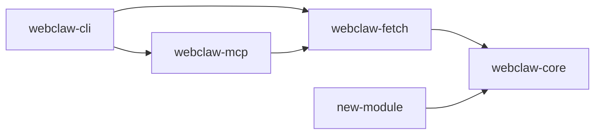

# [Feature Name] Implementation Plan

<!-- Template paraphrased for webclaw (Rust) — inspired by claudekit-engineer (commercial, not redistributed). -->

**Date**: YYYY-MM-DD
**Type**: Feature Implementation
**Status**: Planning
**Crate(s) affected**: [core / fetch / llm / pdf / mcp / cli]
**Context Tokens**: <200 words

## Executive Summary

Mô tả 2-3 câu feature + giá trị (tại sao cần). Ai là user (maintainer / end-user CLI / MCP client / library consumer).

## Context Links

- **Related plans**: [path tới plan khác, không copy nội dung]
- **Dependencies**: crate bên ngoài (cần thêm deps không?), MCP client spec, LLM provider API
- **Reference docs**: `CLAUDE.md`, `.claude/rules/crate-boundaries.md`, external docs link

## Requirements

### Functional Requirements

- [ ] Requirement 1 (observable, testable)
- [ ] Requirement 2
- [ ] Requirement 3

### Non-Functional Requirements

- [ ] Performance target (latency, throughput, memory)
- [ ] Error handling (`Result<T, E>` boundary, không panic trong lib code)
- [ ] WASM-safe nếu chạm `webclaw-core`
- [ ] Test coverage target

## Architecture Overview



### Key Components

- **Component 1** (`crates/webclaw-<crate>/src/<file>.rs`): mô tả ngắn
- **Component 2**: mô tả ngắn

### Data Models

- **Struct 1** (`crates/webclaw-core/src/types.rs` hoặc mới): key fields
- **Struct 2**: key fields

### Public API surface

Nếu feature expose API public, list function/type mới:
- `pub fn foo(bar: &str) -> Result<Baz, FooError>` trong `crates/webclaw-<crate>/src/lib.rs`

## Implementation Phases

### Phase 1: [Tên] (Est: X giờ)

**Scope**: Boundary cụ thể, crate nào động chạm.

**Tasks**:
1. [ ] Task 1 - file: `crates/webclaw-<crate>/src/...rs`
2. [ ] Task 2 - file: `crates/webclaw-<crate>/src/...rs`

**Acceptance Criteria**:
- [ ] Observable behavior 1
- [ ] `cargo test -p webclaw-<crate>` pass

### Phase 2: [Tên] (Est: X giờ)

[Repeat structure]

## Testing Strategy

- **Unit tests**: target coverage cho module mới (`#[cfg(test)] mod tests`)
- **Integration tests**: `tests/*.rs` nếu feature cross-crate
- **Benchmark**: nếu feature chạm hot path (`cargo bench` hoặc `benchmarks/` corpus)
- **Manual smoke test**: CLI command thực tế hoặc MCP tool call

## Security Considerations

- [ ] Không leak secret vào log/error message
- [ ] Validate input ở system boundary (HTTP response, user args, MCP params)
- [ ] `unwrap()` chỉ trong `#[cfg(test)]` hoặc `bin` sau xử lý error
- [ ] WASM-safe nếu chạm core

## Risk Assessment

| Risk | Impact | Mitigation |
|------|--------|------------|
| Feature vi phạm crate boundary | High | `wc-arch-guard` + `wasm_boundary_check.py` |
| Breaking change public API | High | Version bump, CHANGELOG, deprecation |
| Performance regression | Med | Benchmark corpus trước + sau |
| MCP schema incompatibility | Med | `wc-mcp-guard` check schema, bump version MCP server |

## Quick Reference

### Key Commands
```bash
cargo build -p webclaw-<crate>
cargo test -p webclaw-<crate>
cargo clippy -p webclaw-<crate> -- -D warnings
```

### Config Files
- `crates/webclaw-<crate>/Cargo.toml`: feature flags, deps
- `Cargo.toml` (workspace root): nếu thêm workspace dep

## TODO Checklist

- [ ] Phase 1 tasks
- [ ] Phase 2 tasks
- [ ] Testing complete
- [ ] `cargo build --release --workspace` pass
- [ ] `cargo test --workspace` pass
- [ ] `cargo clippy --workspace -- -D warnings` pass
- [ ] Documentation updated (CLAUDE.md nếu structural, SKILL.md nếu MCP tool)
- [ ] CHANGELOG entry
- [ ] `wc-review-v2` 3-stage
- [ ] `wc-pre-commit` checklist
