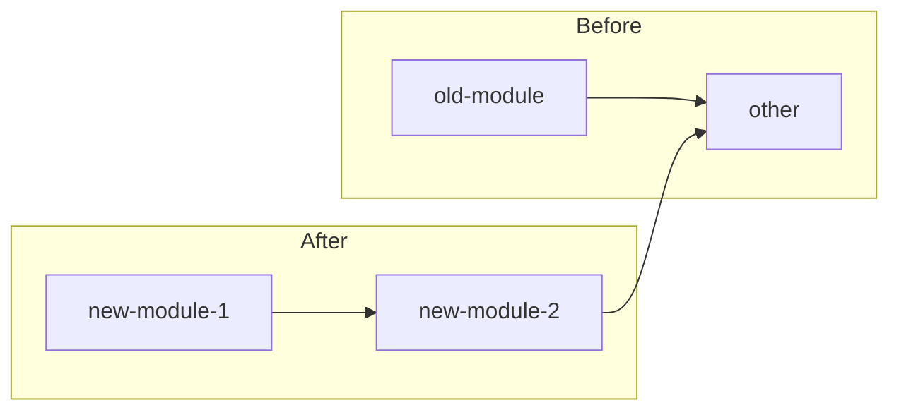

# [Component/Module] Refactoring Plan

<!-- Template paraphrased for webclaw (Rust) — inspired by claudekit-engineer (commercial, not redistributed). -->

**Date**: YYYY-MM-DD
**Type**: Refactoring
**Scope**: [Module / Crate / Cross-crate level]
**Crate(s) affected**: [core / fetch / llm / pdf / mcp / cli]
**Context Tokens**: <200 words

## Executive Summary

Mô tả ngắn gọn cái gì refactor và tại sao. Refactor KHÔNG đổi behavior — nếu đổi behavior → dùng feature-implementation-template.

## Current State Analysis

### Issues với Implementation hiện tại

- [ ] Issue 1: Hot path chậm (latency, alloc)
- [ ] Issue 2: Code duplicate (≥3 nơi)
- [ ] Issue 3: Tech debt (function dài >80 dòng, impl >300 dòng, mixed concerns)
- [ ] Issue 4: Vi phạm crate boundary hiện tại (workaround, không block)

### Metrics (Before)

- **Performance**: `cargo bench` baseline, `benchmarks/` corpus speed
- **Code size**: LOC/function, cyclomatic complexity (`cargo-modules` / manual)
- **Test coverage**: nếu có tool (tarpaulin)
- **Dependency count**: `cargo tree` size

## Context Links

- **Affected modules**: list path, không copy content
- **Dependencies**: crate downstream có gọi API sắp thay đổi không
- **Related issues / PRs**: GitHub link

## Refactoring Strategy

### Approach
Strategy 2-3 câu. Có split file/crate không? Có rename public symbol không (breaking)?

### Architecture Changes

### Key Improvements

- **Improvement 1**: mô tả ngắn (vd: tách `extractor.rs` 1486 dòng thành `extractor/scoring.rs` + `extractor/filter.rs`)
- **Improvement 2**: mô tả ngắn

## Implementation Plan

### Phase 1: Preparation (Est: X giờ)

**Scope**: Setup + safety net trước khi refactor.

1. [ ] Đảm bảo coverage test cho behavior hiện tại (`cargo test -p <crate>`, report gap)
2. [ ] Benchmark baseline (`cargo bench`, hoặc `benchmarks/` corpus timing)
3. [ ] Document behavior edge case cần preserve
4. [ ] `wc-graph` scan blast radius (callers của symbol sắp đổi)

### Phase 2: Core Refactoring (Est: X giờ)

**Scope**: Main refactoring work.

1. [ ] Refactor module A - file: `crates/webclaw-<crate>/src/...rs`
2. [ ] Refactor module B - file: `crates/webclaw-<crate>/src/...rs`
3. [ ] Update integration points (downstream crate)
4. [ ] Preserve public API (hoặc deprecate rõ nếu breaking)

### Phase 3: Integration & Validation (Est: X giờ)

**Scope**: Validation + cleanup.

1. [ ] `cargo test --workspace` pass
2. [ ] `cargo clippy --workspace -- -D warnings` pass
3. [ ] Benchmark post-refactor, compare baseline
4. [ ] `benchmarks/` corpus regression <5% nếu chạm extractor/markdown
5. [ ] Documentation update (CLAUDE.md nếu structural)

## Backward Compatibility

- **Breaking changes**: list cụ thể (API rename, signature change, behavior subtle)
- **Migration path**: steps cho downstream crate + external library consumer
- **Deprecation timeline**: `#[deprecated]` attribute trong 1 version trước remove
- **MCP schema**: nếu refactor chạm `webclaw-mcp` tool, bump MCP server version

## Success Metrics (After)

- **Performance**: target % improvement vs baseline
- **Code quality**: target LOC/function, coverage %
- **Build time**: `cargo check` latency không tệ hơn
- **Dep count**: không thêm crate mới (trừ khi justify)

## Risk Assessment

| Risk | Impact | Mitigation |
|------|--------|------------|
| Breaking change lan downstream | High | Comprehensive integration test + `wc-review-v2` |
| Performance regression | Med | Benchmark before/after, abort nếu >5% slower |
| Refactor vi phạm crate boundary | High | `wc-arch-guard` + `wasm_boundary_check.py` |
| Public API confusion (rename) | Med | Deprecation period, clear CHANGELOG, migration guide |
| Test coverage gap exposed | Low | Phase 1 force coverage review trước refactor |

## TODO Checklist

- [ ] Phase 1: Preparation complete (tests + baseline)
- [ ] Phase 2: Core refactoring complete
- [ ] Phase 3: Integration + validation complete
- [ ] Benchmark validated (no regression)
- [ ] Documentation updated
- [ ] `wc-review-v2` 3-stage
- [ ] `wc-pre-commit` checklist
- [ ] CHANGELOG entry
