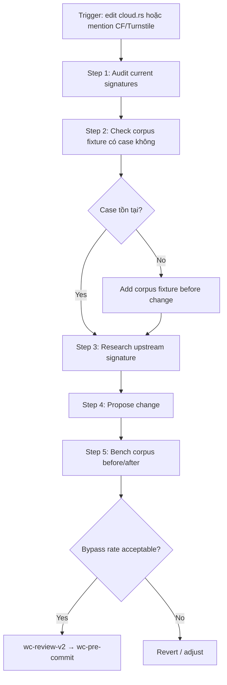

Announce: "Đang dùng wc-bot-detection-audit — verify signature + threshold trước khi sửa."

# webclaw Bot Detection Audit

Guard logic `is_bot_protected()` trong `crates/webclaw-mcp/src/cloud.rs` — detection pattern cho 7+ bot protection provider.

## Current Signature Inventory

(From [crates/webclaw-mcp/src/cloud.rs:115-165](../../../crates/webclaw-mcp/src/cloud.rs), audit định kỳ)

| Provider | Signature | Threshold | Commit ref |
|----------|-----------|-----------|-----------|
| Cloudflare challenge (pure) | `_cf_chl_opt` | Any size | — |
| Cloudflare challenge-platform | `challenge-platform` substring | HTML <50KB | 80307d3 (false positive fix) |
| Cloudflare "Just a moment" | `just a moment` + `cf-spinner` | Any | — |
| Cloudflare Turnstile | `cf-turnstile` OR `challenges.cloudflare.com/turnstile` | HTML <100KB | 80307d3 (false positive fix — widget embedded OK) |
| DataDome | `geo.captcha-delivery.com` OR `captcha-delivery.com/captcha` | Any | — |
| AWS WAF | `awswaf-captcha` OR `aws-waf-client-browser` | Any | — |
| hCaptcha | `hcaptcha.com` + `h-captcha` | HTML <50KB | — |

## Hard Rules (CRITICAL)

### B1 — Corpus fixture trước thay đổi threshold

Không thay đổi threshold mà không có corpus data. **Before:**

```bash
# Lưu baseline
cd D:/webclaw/benchmarks/
cargo run --release -- bench --save baseline.json
grep "bot_bypass" baseline.json
```

**After:**

```bash
# So sánh
cargo run --release -- compare --baseline baseline.json --current current.json
# Verify CF + DataDome bypass rate stable
```

Nếu giảm rate → rollback.

### B2 — False positive / negative tradeoff

| Scenario | False Positive | False Negative |
|----------|---------------|---------------|
| Threshold quá thấp (size limit) | Nhiều: trang normal có widget bị flag | Ít: ít trang real challenge lọt qua |
| Threshold quá cao | Ít | Nhiều: trang challenge nhỏ bị miss |

**Webclaw prefer:** hơi false positive hơn false negative (user thà retry với cloud fallback hơn là extract rác từ trang challenge).

**Current balance (commit 80307d3):**
- CF challenge-platform: <50KB (pure challenge page điển hình 5-30KB)
- CF Turnstile: <100KB (widget embedded contact form có thể 60KB OK)
- hCaptcha: <50KB

### B3 — Upstream signature freshness

Bot protection provider update signature định kỳ. Check reference sources:

| Source | URL | Update cadence |
|--------|-----|----------------|
| scrapfly bypass guide | https://scrapfly.io/blog/ | Quarterly |
| scrapeops playbook | https://scrapeops.io/web-scraping-playbook/ | Quarterly |
| curl-impersonate | https://github.com/lwthiker/curl-impersonate | Chrome version sync |
| ScrapingBee blog | https://www.scrapingbee.com/blog/ | Varies |

Sau 6 tháng không audit → schedule re-check. Dùng `webclaw.research` tool:

```
webclaw.research "Cloudflare Turnstile detection signatures 2026"
```

### B4 — Signature order matters

`is_bot_protected()` check theo order. Fast-path signature (specific string) trước slow (regex / size threshold):

```rust
// GOOD — fast short-circuit
if html_lower.contains("_cf_chl_opt") { return true; }          // Cloudflare pure
if html_lower.contains("challenge-platform") && html.len() < 50_000 { return true; }
// ...

// BAD — size check trước substring
if html.len() < 50_000 && html_lower.contains("challenge-platform") { ... }
// Compiler optimize OK nhưng readability chú ý order
```

### B5 — Header + body co-check

Một số provider signature ở response header:

```rust
// Check server header
if let Some(server) = headers.get("server") {
    if server.to_str().unwrap_or("").contains("cloudflare") {
        // further body check
    }
}
```

CẤM `headers.get(...).unwrap()` — optional header.

### B6 — Provider chain fallback

Khi `is_bot_protected()` return `true`:
1. `SmartFetch` try cloud API fallback (api.webclaw.io)
2. Nếu cloud unavailable → return error với specific code (MCP client thấy)
3. KHÔNG silent return extract từ challenge HTML

## Workflow Audit



### Step 1: Audit current

Read `cloud.rs` full `is_bot_protected()` function. Hiểu mọi branch.

### Step 2: Corpus fixture

Check `benchmarks/corpus/` có case cho provider/scenario sắp sửa không:

```bash
ls benchmarks/corpus/ | grep -i "cf\|turnstile\|datadome"
```

Nếu thiếu → add trước (B1). Fixture nên có:
- 1 "pure challenge" HTML (tiny)
- 1 "widget embedded" HTML (large page với Turnstile contact form)

### Step 3: Research upstream

```
webclaw.research "Cloudflare Turnstile 2026 detection updates"
webclaw.scrape "https://scrapfly.io/blog/posts/how-to-bypass-cloudflare-anti-scraping"
```

Note: signature mới, version browser mới primp cần sync.

### Step 4: Propose change

Viết spec:
- Signature mới: [pattern]
- Threshold: [size / other condition]
- Order position: [trước/sau signature nào]
- Rationale: link tới upstream source

### Step 5: Bench

```bash
cd benchmarks/
cargo run --release -- bench --save before.json
# apply change
cargo run --release -- bench --save after.json
cargo run --release -- compare --baseline before.json --current after.json
```

Focus: bot_bypass rate không giảm.

## Output Format

```
## Bot Detection Audit — [provider/change]

### Current Signature (before change)
[Code snippet từ cloud.rs]

### Proposed Change
- Pattern: [...]
- Threshold: [...]
- Rationale: [why + source link]

### Corpus Fixture
- Cases added: [list]
- Cases coverage: [pure challenge ✓ / widget embedded ✓]

### Bench Result
- CF bypass: [X% → Y%]
- DataDome bypass: [A% → B%]
- Verdict: [acceptable / revert]

### Verdict
ALLOW CHANGE | BLOCK CHANGE (lý do)

### Next
→ wc-review-v2 → wc-pre-commit
```

## Integration

- `wc-cook` Step 4 invoke khi plan chạm cloud.rs
- `wc-scenario` dimension 2 (Bot Protection) có overlap — scenario list edge case
- `wc-extraction-bench` C5 chạy corpus regression sau change
- `wc-pre-commit` C10 verify no regression
