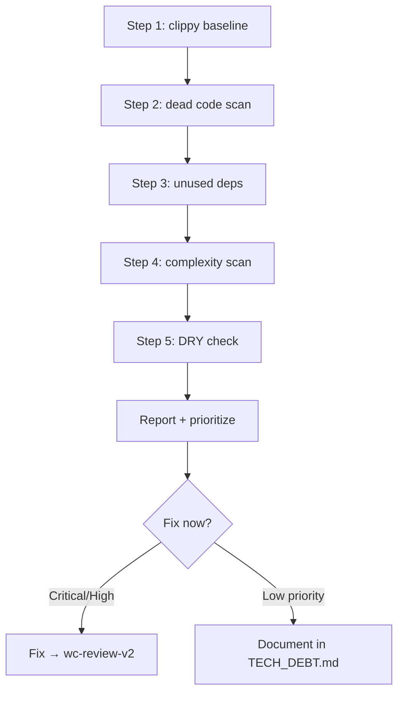

Announce: "Đang dùng wc-code-audit — phát hiện dead code, unused deps, complexity."

# webclaw Code Audit

Tool set để rà soát chất lượng Rust code sau khi viết.

## Required Tools

```bash
# Built-in với cargo
cargo clippy --workspace -- -W clippy::pedantic

# Extras (install riêng)
cargo install cargo-machete  # unused workspace deps
cargo install cargo-udeps    # unused deps (nightly required)
# cargo-deny đã ở wc-deps-audit
```

## Quy trình Audit



### Step 1: Clippy baseline

```bash
cd D:/webclaw
cargo clippy --workspace --all-targets -- -D warnings
```

Pass first (required để tiếp). Nếu warning → fix trước.

Sau đó chạy với `pedantic` + `nursery`:

```bash
cargo clippy --workspace -- -W clippy::pedantic -W clippy::nursery
```

Pedantic lint không block, nhưng review để clean-up.

### Step 2: Dead Code Scan

```bash
# Rustc built-in warning (enabled by default nếu clippy pass)
cargo build --workspace 2>&1 | grep "dead_code\|unused_variable"

# Manual scan code comment-out >3 dòng
grep -rn "^\s*//" crates/*/src/ | awk 'NR==FNR || NR-prev>1' | ...
```

Banned pattern (từ wc-output-guard):
- `// ... rest of X`
- `// TODO: implement`
- `todo!()` / `unimplemented!()` trong public API
- Commented-out block >3 dòng liên tiếp
- `_old_*`, `_deprecated_*`, `_backup_*` variable name

### Step 3: Unused Dependencies

```bash
# cargo-machete: scan workspace deps không dùng
cargo machete

# cargo-udeps (nightly): chi tiết hơn
cargo +nightly udeps --workspace --all-targets
```

Output: list deps trong `Cargo.toml` không được import anywhere.

**Action:**
- Nếu confirm unused → remove từ `Cargo.toml`
- Nếu dùng qua feature flag → verify feature active trong CI
- Nếu dev-dependency only → move sang `[dev-dependencies]`

### Step 4: Complexity Scan

```bash
# Hàm >80 dòng (reference wc-graph awk script)
awk '/^(pub )?(async )?fn / { fn=$0; count=0; file=FILENAME }
     /^}$/ { if (count > 80) print file": "NR" — "count" lines — "fn; count=0 }
     { count++ }' crates/*/src/*.rs

# File >500 dòng
find crates/*/src -name "*.rs" -exec wc -l {} \; | awk '$1 > 500'

# Impl block >300 dòng (harder, grep approximate)
grep -n "^impl " crates/*/src/*.rs
# Manual review each impl block size
```

Reference thresholds (development-rules.md):
- fn >80 dòng → consider split
- impl >300 dòng → consider sub-module
- file >500 dòng → consider split (exception: extractor.rs 1486, markdown.rs 1431, brand.rs 1340, main.rs 2372 — CÓ CHỦ ĐÍCH)

### Step 5: DRY Check

```bash
# Tìm pattern lặp lại (simplify with Rust)
# Simple: grep for common code smells
grep -rn "\.unwrap()\.to_string()" crates/*/src/  # prefer .to_string() nếu Display impl
grep -rn "Vec::new(); for" crates/*/src/          # prefer iter.collect()
grep -rn "if.*is_some().*unwrap" crates/*/src/    # prefer .map/.and_then

# Function trùng tên khác crate (potential dup)
for c in crates/webclaw-*; do
  grep -h "^\(pub \)\?fn [a-z_]*(" $c/src/*.rs | sort -u
done | sort | uniq -cd
```

## Clippy Allow List

Webclaw có thể allow lint sau (nếu thấy valid):

```toml
# crates/<crate>/src/lib.rs hoặc main.rs
#![allow(clippy::module_name_repetitions)]  # OK trong HTML parser context
#![allow(clippy::too_many_lines)]           # extractor.rs có chủ đích
```

CẤM allow:
- `clippy::unwrap_used`
- `clippy::expect_used`
- `clippy::panic`
- `clippy::pedantic::cognitive_complexity` (không track được)
- Bất kỳ lint liên quan safety/correctness

## Output Format

```
## Code Audit Report: [scope]

### Clippy
- Base: [X warnings (must be 0 with -D warnings)]
- Pedantic: [Y warnings]
- Nursery: [Z warnings]

### Dead Code
- Banned patterns: [N occurrences]
- Commented blocks >3 lines: [list file:line]
- `todo!()` in public API: [list]

### Unused Deps (cargo-machete / udeps)
- crates/webclaw-<crate>/Cargo.toml: unused [dep1, dep2]

### Complexity
- Functions >80 LOC: [count] — [list if any]
- Files >500 LOC (new exceptions): [list]

### DRY
- Duplicate patterns: [count] — [description]

### Priority
| Item | Severity | Action |
|------|----------|--------|
| unwrap_used in lib code | Blocking | Replace with `?` |
| Unused dep `foo` | Low | Remove from Cargo.toml |
| fn X >80 LOC | Medium | Consider split |

### Next
- Critical/High → Fix → wc-review-v2
- Low → Document TECH_DEBT.md
```

## Integration với CI

Gợi ý thêm job `.github/workflows/ci.yml`:

```yaml
- name: cargo clippy strict
  run: cargo clippy --workspace --all-targets -- -D warnings

- name: cargo machete
  run: cargo machete
```

wc-pre-commit C4 đã check `clippy -D warnings`. wc-code-audit bổ sung pedantic + unused deps check.
