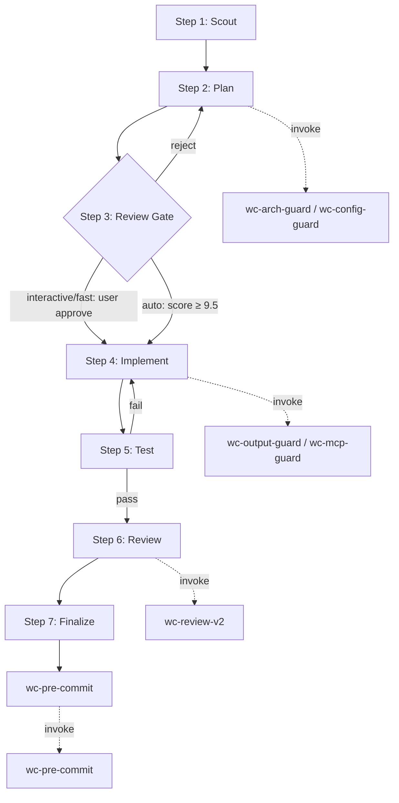

Announce: "Đang dùng wc-cook — quy trình implement có plan trước khi code."

<HARD-GATE>
KHÔNG viết code implementation cho đến khi có plan và đã review.
Áp dụng BẤT KỂ task đơn giản hay phức tạp. "Đơn giản" = nơi assumptions sai nhiều nhất.
Exception: `--fast` skip research nhưng VẪN cần plan step.
User override: Nếu user nói "cứ code đi", "skip planning" → tôn trọng, NHƯNG announce:
"⚠ Bypass planning gate. Nếu gặp vấn đề kiến trúc/integration (crate boundary, WASM-safe, MCP schema) → quay lại Step 1-2.
Gate tồn tại vì plan sai ít tốn kém hơn code sai."
</HARD-GATE>

## Anti-Rationalization Table (CRITICAL)

| Bạn nghĩ | Thực tế |
|-----------|---------|
| "Task đơn giản quá, không cần plan" | Task đơn giản hay có hidden complexity (WASM leak, patch drift). Plan mất 30 giây. |
| "Tôi đã biết cách làm" | Biết ≠ plan. Viết ra. |
| "Để code trước đã" | Code thiếu kỷ luật = lãng phí token + `cargo check` fail. Plan trước. |
| "User muốn nhanh" | Nhanh nhất = plan→implement→done. Không phải: implement→debug→rewrite. |
| "Lần này thôi" | Mỗi lần skip đều là "lần này thôi". Không ngoại lệ. |
| "Chỉ chạm 1 crate" | Crate boundary bị vi phạm từ 1 import duy nhất. |

## Mode Selection (IMPORTANT)

| Flag | Research | Test | Review Gate | Ghi chú |
|------|----------|------|-------------|---------|
| `--interactive` (default) | ✓ | ✓ | User approve mỗi step | Đầy đủ nhất |
| `--fast` | ✗ | ✓ | User approve mỗi step | Skip research (có từ predict/github-ref) |
| `--auto` | ✓ | ✓ | Auto nếu score ≥ 9.5 | Không dừng |

## Quy trình 7 bước (CRITICAL)



**Sơ đồ là nguồn chuẩn. Nếu prose mâu thuẫn, theo sơ đồ.**

### Step 1: Scout (BẮT BUỘC)

- Khảo sát crate liên quan + file cụ thể (`crates/webclaw-<crate>/src/...rs`)
- Đọc `CLAUDE.md` + `.claude/rules/crate-boundaries.md` để xác định constraint
- `git log --oneline -5 -- crates/webclaw-<crate>/` để hiểu context gần đây
- Đọc existing test nếu có (`#[cfg(test)] mod tests` inline hoặc `tests/*.rs`)
- Check `Cargo.toml` của crate: deps, feature flags

Output: `✓ Step 1: Scouted — N files, M deps, K tests`

### Step 2: Plan

- Viết plan theo template `.claude/plans/templates/feature-implementation-template.md` hoặc `refactor-template.md`
- Plan phải có: goal, files cần sửa/tạo, risk assessment, rollback
- **INVOKE wc-arch-guard** nếu plan thay đổi dependency direction / crate boundary / WASM-safe core
- **INVOKE wc-config-guard** nếu plan đọc/ghi `Cargo.toml` / `.cargo/config.toml` / env var
- **INVOKE wc-mcp-guard** nếu plan thêm/sửa MCP tool trong `crates/webclaw-mcp/`
- Plan format: numbered step, mỗi step có absolute file path + action cụ thể

Output: `✓ Step 2: Planned — N steps, M files, P guards invoked`

### Step 3: Review Gate (CRITICAL)

- Interactive/fast: DỪNG, hỏi user approve plan
- Auto: tự approve nếu confidence ≥ 9.5/10
- Bị reject → quay lại Step 2
- Check plan có vi phạm rule nào trong `.claude/rules/` không

Output: `✓ Step 3: Plan approved`

### Step 4: Implement

- Code theo plan, KHÔNG đi xa hơn plan
- **INVOKE wc-output-guard** nếu output >200 dòng hoặc tạo file mới
- **INVOKE wc-mcp-guard** nếu chạm `crates/webclaw-mcp/src/server.rs` (tool registration)
- Tạo TodoWrite cho từng step trong plan
- Prefer `cargo check -p <crate>` sau mỗi file edit để catch sớm

Output: `✓ Step 4: Implemented — N files changed`

### Step 5: Test

- `cargo test -p webclaw-<crate>` (scope hẹp trước)
- `cargo test --workspace` trước finalize (scope full)
- Nếu thêm public API mới → viết test
- Nếu chạm extractor / markdown / brand → chạy `benchmarks/` corpus compare ground-truth

Output: `✓ Step 5: Tests passed — N tests, 0 failures`

### Step 6: Review

- **INVOKE wc-review-v2** — 3-stage (spec → quality → adversarial)
- Scope gate: skip Stage 3 nếu ≤2 file VÀ ≤30 dòng VÀ không chạm core/mcp

Output: `✓ Step 6: Reviewed — X findings`

### Step 7: Finalize (BẮT BUỘC — không bao giờ skip)

- **INVOKE wc-pre-commit** — 10 mục bắt buộc
- Cập nhật `CLAUDE.md` nếu thêm crate / thay đổi hard rule
- Cập nhật `CHANGELOG` nếu public-facing
- Hỏi user commit hay chưa

Output: `✓ Step 7: Finalized`

## Guard Integration Points (CRITICAL)

| Step | Guard Skill | Điều kiện |
|------|-------------|-----------|
| Plan | wc-arch-guard | Thay đổi dependency direction / WASM-safe / crate boundary |
| Plan | wc-config-guard | Đọc/ghi Cargo.toml / env var / RUSTFLAGS |
| Plan | wc-mcp-guard | Thêm/sửa MCP tool |
| Implement | wc-output-guard | Code >200 dòng hoặc file mới |
| Implement | wc-mcp-guard | Chạm `crates/webclaw-mcp/src/server.rs` |
| Implement | wc-bot-detection-audit | Chạm `crates/webclaw-mcp/src/cloud.rs` |
| Finalize | wc-pre-commit | LUÔN LUÔN |

## Output Format (CONTEXT)

```
✓ Step 1: Scouted — 5 files, 3 deps, 2 tests
✓ Step 2: Planned — 4 steps, 3 files, 2 guards invoked (arch + config)
✓ Step 3: Plan approved
✓ Step 4: Implemented — 3 files changed
✓ Step 5: Tests passed — 12 tests, 0 failures
✓ Step 6: Reviewed — 0 blocking, 1 nit
✓ Step 7: Finalized — ready to commit
```
