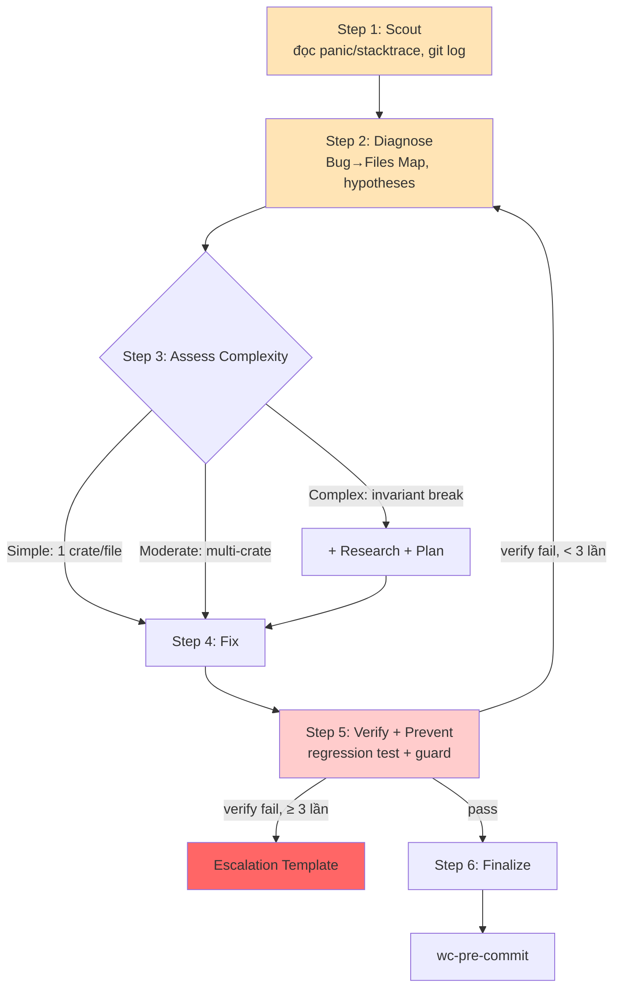

Announce: "Đang dùng wc-debug-map — diagnose root cause trước khi fix."

<HARD-GATE>
KHÔNG đề xuất hoặc implement fix trước khi hoàn thành Step 1-2 (Scout + Diagnose).
Fix triệu chứng = failure. Tìm nguyên nhân trước qua phân tích có cấu trúc, KHÔNG đoán.
Nếu 3+ lần fix thất bại → DỪNG, xem xét lại kiến trúc — dùng Escalation Template.
</HARD-GATE>

## Anti-Rationalization Table (CRITICAL)

| Bạn nghĩ | Thực tế |
|-----------|---------|
| "Tôi thấy vấn đề rồi, fix luôn" | Thấy triệu chứng ≠ hiểu root cause. Scout trước. |
| "Fix nhanh trước, tìm hiểu sau" | "Sau" không bao giờ đến. Fix đúng ngay. |
| "Thử đổi X xem sao" | Fix random lãng phí token + tạo bug mới. Diagnose trước. |
| "Chắc là do X" | "Chắc" = đoán. Dùng structured diagnosis. Verify trước. |
| "Thử fix thêm lần nữa" (sau 2+) | 3+ failures = sai hướng. Xem xét lại kiến trúc. |
| "Fix xong, test pass rồi" | Không có prevention = cùng class bug sẽ tái phát. Thêm guard. |

## Quy trình 6 bước (CRITICAL)



**Sơ đồ là nguồn chuẩn.** Step 1-2 HARD-GATE — không skip.

### Step 1: Scout (BẮT BUỘC)

- Đọc error / panic message / backtrace đầy đủ
  - `RUST_BACKTRACE=1 cargo run ...` nếu chỉ có error message không có stack
- Khảo sát file bị ảnh hưởng (cột 1 Bug→Files Map bên dưới)
- `git log --oneline -5 -- crates/<crate>/` context thay đổi gần đây
- Check CI log gần đây nếu bug xuất hiện từ 1 commit cụ thể

### Step 2: Diagnose (BẮT BUỘC)

- **Capture pre-fix state**: ghi lại chính xác panic message, test output, backtrace
- Dùng **Bug→Files Map** để trace theo category
- Hình thành hypotheses có cấu trúc — KHÔNG đoán
- Output: confirmed root cause + evidence chain

### Step 3: Assess Complexity

| Level | Dấu hiệu | Workflow |
|-------|---------|---------|
| Simple | 1 file, panic message rõ, stack trace clear | Scout→Diagnose→Fix→Verify |
| Moderate | Multi-file hoặc cross-crate | Full 6-step pipeline |
| Complex | Invariant break (WASM leak, crate boundary), intermittent | + wc-research-guide + wc-predict trước fix |

### Step 4: Fix

- Fix theo diagnosis — fix ROOT CAUSE, không triệu chứng
- Thay đổi tối thiểu. Theo pattern hiện có.
- Nếu fix chạm public API → cẩn thận semver, CHANGELOG

### Step 5: Verify + Prevent (BẮT BUỘC)

- **Verify**: chạy CHÍNH XÁC commands từ pre-fix state. So sánh output. KHÔNG claim fix mà không evidence.
  - `cargo test <specific_test>` trước → `cargo test --workspace` sau
  - Nếu bug từ benchmark regression → re-run corpus
- **Regression test**: thêm test cover issue. Test PHẢI fail không có fix, pass với fix.
- **Prevention gate**: guard cho LỚP BUG, không chỉ instance.
- Nếu verify fail → Step 2. Sau 3 failures → DỪNG, Escalation Template.

### Escalation Template (khi 3+ fix fail)

Sau 3 lần fix thất bại cho **[bug description]**:

- **Root cause phỏng đoán**: [...]
- **3 approaches đã thử**: [1] ... [2] ... [3] ...
- **Vấn đề có thể ở**: kiến trúc / upstream crate / external service (SerpAPI, Ollama)
- **Đề xuất**:
  (A) Redesign [component]
  (B) Workaround [approach] + track technical debt in `docs/KNOWN_ISSUES.md`
  (C) Defer + ghi `KNOWN_ISSUES.md`
Bạn muốn chọn hướng nào?

### Step 6: Finalize (BẮT BUỘC)

- **INVOKE wc-pre-commit** — 10 mục
- Cập nhật `docs/TROUBLESHOOTING.md` (nếu có, hoặc tạo) nếu bug class mới

---

## Bug → Files Map (TRACE BACKWARD)

### Panic / unwrap site

```
1. Đọc panic message: "called Option::unwrap() on None" / "index out of bounds"
2. Stack trace top frame → file:line cụ thể
3. Grep `.unwrap()\|.expect(` trong crate liên quan
4. Check: có path nào không validate input trước unwrap không?
```

Typical files:
- `crates/webclaw-core/src/extractor.rs` (selector match)
- `crates/webclaw-core/src/markdown.rs` (URL parse)
- `crates/webclaw-mcp/src/cloud.rs` (header parsing)

### Extraction quality regression

```
1. cd benchmarks/ && cargo run --release -- compare --baseline pre --current post
2. Xem diff: URL nào regression nhiều nhất?
3. Manual scrape URL đó, đọc HTML raw
4. Check: extractor scoring / noise filter / data_island fallback thay đổi gì
```

Typical files:
- `crates/webclaw-core/src/extractor.rs` (scoring)
- `crates/webclaw-core/src/noise.rs` (filter)
- `crates/webclaw-core/src/data_island.rs` (SPA fallback)

### Bot detection false positive/negative

```
1. Xem HTML size + HTML preview
2. Check crates/webclaw-mcp/src/cloud.rs is_bot_protected() threshold
3. So với signature scrapfly/scrapeops doc gần đây
4. Test case: reproduce với corpus fixture
```

Typical files:
- `crates/webclaw-mcp/src/cloud.rs` (threshold)
- `crates/webclaw-fetch/src/browser.rs` (profile)

### MCP client disconnect / schema mismatch

```
1. Đọc rmcp error log (stderr of webclaw-mcp.exe)
2. Check JSON schema tool output: `cargo run -p webclaw-mcp -- list-tools` (nếu có)
3. Diff `crates/webclaw-mcp/src/server.rs` tool signatures vs spec
4. Check rmcp version pin (Cargo.toml)
```

Typical files:
- `crates/webclaw-mcp/src/server.rs` (tool registration)
- `crates/webclaw-mcp/Cargo.toml` (rmcp version)

### Build fail (WASM target, cross-platform)

```
1. Read full `cargo build` error
2. Check: có dùng std::fs/std::net/tokio trong webclaw-core?
3. Dep compatibility: `cargo tree` xem conflict
4. Platform-specific: Windows vs Linux path separator, line ending
```

Typical files:
- `crates/webclaw-core/src/lib.rs` (entry module)
- `Cargo.toml` workspace root (patch.crates-io drift)

### LLM provider chain fail

```
1. Check order fallback: Ollama → OpenAI → Anthropic
2. Env var: OLLAMA_HOST, OPENAI_API_KEY, ANTHROPIC_API_KEY set đúng?
3. qwen3 think-tag leak (strip 2 tầng?)
4. Network: `curl $OLLAMA_HOST/api/tags` reachable?
```

Typical files:
- `crates/webclaw-llm/src/chain.rs` (chain logic)
- `crates/webclaw-llm/src/providers/*.rs` (provider impl)

### Provider timeout / rate limit

```
1. Check primp profile: Chrome 142/136/133/131, Firefox 144/135/133/128 — upstream drift?
2. Proxy pool health (crates/webclaw-fetch/src/proxy.rs)
3. Retry strategy: exponential backoff implement đúng?
```

Typical files:
- `crates/webclaw-fetch/src/client.rs`
- `crates/webclaw-fetch/src/browser.rs`
- `crates/webclaw-fetch/src/proxy.rs`

## 5 Silent Bug Classes (IMPORTANT — tích lũy)

> Bug không panic nhưng cho kết quả sai. Cái này nguy hiểm hơn panic.

1. **qwen3 `<think>` leak** — strip 1 tầng, consumer thấy raw thinking trong MCP output
2. **primp profile drift** — Chrome version trong primp lạc hậu → CF block (503) mà error message chỉ nói "bot detected"
3. **Data island fallback miss** — threshold word count 30 không trigger cho page SPA có 31 word visible + 10K JSON data → extract garbage
4. **Bot detection threshold** — Turnstile widget embedded page 60KB bị detect như challenge (threshold 50KB thấp)
5. **Extractor scoring skew** — noise filter xóa `<article>` có `class="advertisement"` (false positive) → extraction empty

Khi gặp extraction "sai" hoặc "không như expected" mà không panic → check 5 class này trước.

## Output Format

```
## Debug Report: [bug description]

### Step 1: Scout
- Error: [exact panic / message]
- Stack trace: [file:line top frame]
- Recent commits affecting area: [git log result]

### Step 2: Diagnose
- Hypothesis 1: [reasoning] — Evidence: [found / not found]
- Hypothesis 2: ...
- **Confirmed root cause**: [X]

### Step 3: Complexity
- Simple / Moderate / Complex — [reason]

### Step 4: Fix
- File: `crates/...rs:L123`
- Change: [brief]

### Step 5: Verify + Prevent
- Verify: [command + expected output]
- Regression test: [path to new test]
- Prevention: [guard hoặc rule update]

### Step 6: Finalize
→ wc-pre-commit
```
