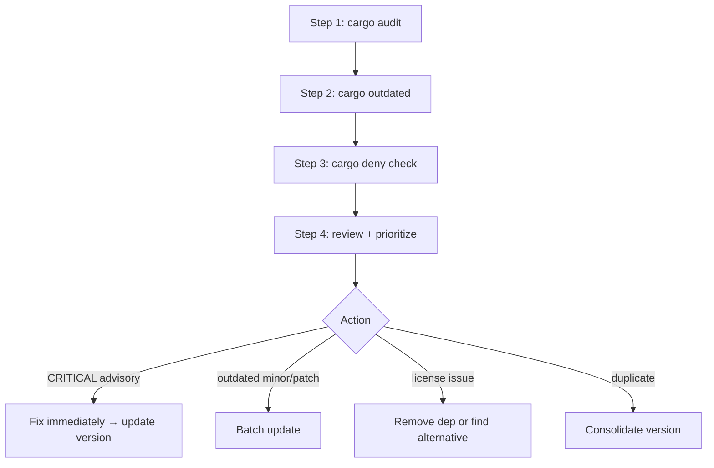

Announce: "Đang dùng wc-deps-audit — kiểm tra bảo mật + cập nhật + license packages."

# webclaw Dependency Audit

**Nguyên tắc:** Dependencies là attack surface lớn nhất. Kiểm tra định kỳ.

## Required Tools

```bash
cargo install cargo-audit    # RustSec advisory DB
cargo install cargo-outdated # semver outdated detection
cargo install cargo-deny     # license + ban + duplicate + advisory (alternative to audit)
```

## Quy trình



### Step 1: cargo audit (security advisory)

```bash
cd D:/webclaw
cargo audit
```

Output: list known vulnerability trong deps (theo RustSec Advisory DB).

**Severity levels:**

| Level | Action |
|-------|--------|
| **Critical** | Fix NOW. Block commit/release cho đến khi patched. |
| **High** | Fix trong tuần. Document nếu không patch được. |
| **Medium** | Fix trong sprint. Có thể defer nếu không ảnh hưởng webclaw use case. |
| **Low** | Note trong `SECURITY.md`, fix khi convenient. |
| **Informational** | Advisory review, không require action. |

**Patch approach:**

```bash
# Update specific crate
cargo update -p <crate-name>

# Hoặc bump version trong Cargo.toml
# crates/webclaw-<crate>/Cargo.toml: version = "1.2.3" → "1.2.4"

# Hoặc workspace-level
# Cargo.toml (root) [workspace.dependencies]: <crate> = "1.2.4"
```

Re-run `cargo audit` xác nhận fixed.

### Step 2: cargo outdated

```bash
cargo outdated --workspace --depth 1
```

Output: bảng các direct deps có version mới.

**Columns meaning:**
- **Project**: version trong Cargo.toml
- **Compat**: latest compatible với semver range
- **Latest**: absolute latest (có thể major version mới)

**Action:**

| Situation | Action |
|-----------|--------|
| Project < Compat (minor bump available) | Safe update — run test sau |
| Compat < Latest (major bump available) | Review breaking change — `CHANGELOG` của crate |
| Project = Latest | Up-to-date, skip |

**Pin version strategy:**

- Path deps (webclaw-*): khớp workspace version
- External deps: prefer `"1.0"` (minor auto-update), avoid `"="` exact
- Security-sensitive (tls stack, serde): pin tighter `"1.0.x"` nếu concern

### Step 3: cargo deny check

```bash
# Nếu chưa có deny.toml
cargo deny init

# Full check
cargo deny check
# Hoặc split:
cargo deny check advisories   # equivalent to cargo audit
cargo deny check licenses
cargo deny check bans
cargo deny check sources
```

#### License check

webclaw license: **AGPL-3.0**. Compatible deps:

| Dep license | Compatible? |
|-------------|-------------|
| MIT, Apache-2.0, BSD-2/3 | ✅ Yes |
| Unlicense, 0BSD, CC0 | ✅ Yes |
| MPL-2.0 | ✅ Yes (weak copyleft, file-level) |
| LGPL-2.1 / LGPL-3.0 | ⚠ Conditional (dynamic link OK, static link GPL taint) |
| GPL-3.0 | ✅ Compatible với AGPL-3.0 |
| AGPL-3.0 | ✅ Same license |
| GPL-2.0 only (không "or later") | ❌ Incompatible AGPL |
| Proprietary / Commercial | ❌ Block |
| Unlicensed | ❌ Block (no grant) |

Setup trong `deny.toml`:

```toml
[licenses]
unlicensed = "deny"
allow = ["MIT", "Apache-2.0", "Apache-2.0 WITH LLVM-exception",
         "BSD-2-Clause", "BSD-3-Clause", "0BSD", "Unicode-DFS-2016",
         "MPL-2.0", "AGPL-3.0"]
confidence-threshold = 0.93
```

#### Ban check

Cấm crate có vấn đề known:

```toml
[bans]
multiple-versions = "warn"  # allow với warn
wildcards = "deny"          # banned "*" version

[[bans.deny]]
name = "openssl"  # ví dụ: prefer rustls cho consistency
reason = "Webclaw uses rustls via wreq BoringSSL, không mix openssl"
```

#### Sources check

Cấm deps từ source không tin cậy:

```toml
[sources]
unknown-git = "deny"
unknown-registry = "deny"
allow-git = []  # thêm explicit nếu cần
```

### Step 4: Review + Prioritize

Sort findings theo severity + effort:

| Finding type | Priority | Typical effort |
|--------------|----------|----------------|
| Critical advisory (RCE, auth bypass) | P0 | Hours — fix NOW |
| High advisory | P1 | Days |
| License incompatible | P1 | Hours (remove/replace) |
| Duplicate version (3+ copies) | P2 | Medium (version align) |
| Minor outdated | P3 | Low (batch monthly) |
| Unused dep (via wc-code-audit) | P3 | Low (remove Cargo.toml) |

## webclaw-specific concerns

### primp / wreq patched crates

`[patch.crates-io]` trong workspace root cho rustls/h2 forks. Khi audit:

```bash
# Check patch section
grep -A20 "patch.crates-io" Cargo.toml

# Verify fork upstream still active
# Usually lwthiker/curl-impersonate style forks
```

**Risk:** nếu upstream fork stop maintain → stale security patch. Plan migration.

### tokio full feature

Workspace `tokio = { features = ["full"] }` import entire ecosystem. Consider trim features khi release:

```toml
# Ideal per-crate (future):
# webclaw-mcp: tokio = { features = ["rt-multi-thread", "macros", "io-util"] }
# webclaw-fetch: tokio = { features = ["rt", "net", "time"] }
```

### Supply chain: new crate review

Trước khi thêm dep mới:

1. **Maintained?** — last commit / release < 6 tháng
2. **Downloads** — crates.io stats > 10k/tháng ideal
3. **Deps size** — `cargo tree <crate>` count transitive
4. **License** — check compatible AGPL-3.0
5. **Security advisory history** — cargo audit DB

Log new dep trong CHANGELOG hoặc dedicated doc.

## Output Format

```
## Dependency Audit Report

### cargo audit
- Critical: 0
- High: 0
- Medium: 1 — [crate 1.2.3 → patch 1.2.4 available]
- Low: 2

### cargo outdated (workspace direct)
| Package | Project | Compat | Latest | Type |
|---------|---------|--------|--------|------|
| serde | 1.0.195 | 1.0.210 | 1.0.210 | minor |
| rmcp | 1.2 | 1.2 | 1.3 | major (breaking) |

### cargo deny
- Licenses: PASS (all compatible AGPL-3.0)
- Bans: 0 violations
- Duplicates: 2 (tokio 1.35 + 1.40 via transitive)
- Sources: PASS

### Priority Actions
1. [P0] Update <crate> 1.2.3→1.2.4 (CVE-XXXX)
2. [P1] Consolidate tokio duplicate (cargo update)
3. [P3] Review rmcp 1.3 breaking change (defer, plan migration)

### Next
- P0/P1 fix → wc-pre-commit
- P2/P3 document in `docs/DEPS_PLAN.md`
```

## Integration với CI

Gợi ý `.github/workflows/deps.yml` (có thể đã tồn tại):

```yaml
- name: cargo audit
  run: cargo audit --deny warnings

- name: cargo deny check
  run: cargo deny check
```

wc-pre-commit C6 check `cargo audit` + `cargo deny` trước commit.
