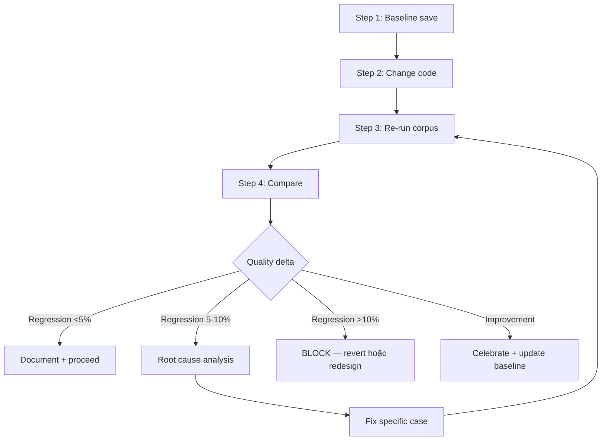

Announce: "Đang dùng wc-extraction-bench — corpus regression check."

# webclaw Extraction Benchmark

Corpus-based regression check cho extractor / markdown / brand / noise / data_island.

## Corpus Structure (reference)

```
benchmarks/
├── README.md                    # suite doc
├── corpus/                      # raw HTML fixtures
│   ├── news/
│   │   ├── bbc_tech_2026.html
│   │   └── ...
│   ├── docs/
│   ├── blogs/
│   ├── spa/
│   ├── ecommerce/
│   └── edge_cases/
├── ground-truth/                # manual annotation
│   ├── news/
│   │   ├── bbc_tech_2026.json   # { title, author, content_markdown, ... }
│   │   └── ...
│   └── ...
└── src/
    └── main.rs                  # runner
```

Total ~50 trang diverse. Baseline metrics (commit 6b23b6b): 95.1% avg extraction quality, 12.1ms speed (500KB), -67% token, 97% CF bypass, 91% DataDome bypass.

## Workflow



### Step 1: Baseline save (TRƯỚC change)

```bash
cd D:/webclaw/benchmarks/
cargo run --release -- bench --save baseline.json
```

Commit `baseline.json` hoặc lưu temp nếu chỉ local check.

### Step 2: Code change

Sửa core extraction logic. Verify `cargo check -p webclaw-core` pass.

### Step 3: Re-run corpus

```bash
cd D:/webclaw/benchmarks/
cargo run --release -- bench --save current.json
```

### Step 4: Compare

```bash
cd D:/webclaw/benchmarks/
cargo run --release -- compare --baseline baseline.json --current current.json
```

Output format (reference):

```
=== Benchmark Compare ===

Overall quality:
  Baseline: 95.1% avg
  Current:  94.8% avg
  Delta:    -0.3% (within tolerance)

Per-category:
| Category    | Baseline | Current | Delta   | Status  |
|-------------|----------|---------|---------|---------|
| news        | 96.2%    | 96.2%   | +0.0%   | STABLE  |
| docs        | 95.5%    | 95.3%   | -0.2%   | STABLE  |
| blogs       | 94.0%    | 93.8%   | -0.2%   | STABLE  |
| spa         | 92.5%    | 91.1%   | -1.4%   | WATCH   |
| edge_cases  | 88.0%    | 85.5%   | -2.5%   | WATCH   |

Per-page regressions (>5% drop):
  - corpus/spa/nextjs_blog_case.html: -8.2% (title extraction miss)
  - corpus/edge_cases/mixed_encoding.html: -6.1% (noise filter false positive)

Speed:
  p50: 11.8ms → 12.3ms (+4.2%)
  p95: 18.5ms → 19.1ms (+3.2%)

Bot bypass:
  CF: 97% → 97% (unchanged)
  DataDome: 91% → 91% (unchanged)
```

## Tolerance Thresholds

| Delta | Severity | Action |
|-------|----------|--------|
| ≤ -1% | NORMAL | Accept, note in commit message |
| -1% to -5% | WATCH | Investigate regression pages, decide defer or fix |
| -5% to -10% | BLOCK | Root cause required before commit |
| > -10% | HARD BLOCK | Revert change, redesign approach |
| Speed +5% | WATCH | Profile hot path (wc-optimize) |
| Speed +20% | BLOCK | Significant perf regression |

## Common Regression Sources

| Category | Typical cause | Check |
|----------|---------------|-------|
| News | Noise filter too aggressive (remove article byline) | Diff noise.rs selectors |
| Docs | Extractor miss code block inline | markdown.rs code extraction |
| Blogs | Author extraction from wrong meta tag | metadata.rs og:article:author |
| SPA | Data island threshold word count changed | data_island.rs MIN_WORDS const |
| Edge | Encoding detection wrong | client.rs charset detect |

## Adding New Corpus Case

```bash
# 1. Save HTML fixture
curl -o benchmarks/corpus/<category>/<name>.html <URL>

# 2. Manual extract ground truth
# Open HTML in browser, copy title/author/content to JSON:
cat > benchmarks/ground-truth/<category>/<name>.json <<EOF
{
  "url": "https://...",
  "title": "...",
  "author": "...",
  "description": "...",
  "content_markdown": "# ...\n\n..."
}
EOF

# 3. Re-run baseline to include
cargo run --release -- bench --save baseline.json

# 4. Commit both files together
git add benchmarks/corpus/<category>/<name>.html
git add benchmarks/ground-truth/<category>/<name>.json
```

**Fixture licensing:** prefer pages với permissive license (Creative Commons, MIT docs, open content). Avoid proprietary news with strict ToS.

## Metrics Computation (reference)

Extraction quality per page = weighted average:
- Title match (fuzzy string similarity): 25%
- Author match: 10%
- Content similarity (BLEU-like): 40%
- Metadata completeness: 15%
- Markdown structure (heading hierarchy): 10%

Baseline implementation: `benchmarks/src/metrics.rs`.

## DO NOT

- Tweak scoring threshold để bypass regression (fix real issue)
- Accept >5% regression mà không root cause analysis
- Remove corpus case để pass (thêm, không bớt)
- Compare với baseline khác workspace version (need re-save baseline)

## Output Format

```
## Extraction Bench Report

Baseline commit: [abc123]
Current commit: [def456]

### Overall
- Quality: [X% → Y%] ([delta%], [STABLE/WATCH/BLOCK])
- Speed p50: [A ms → B ms] ([delta%])
- Bot bypass: [unchanged / affected]

### Per-category (nếu significant delta)
[table]

### Regression pages (>5% drop)
1. [path] — root cause: [explanation] — fix: [plan]

### Verdict
- PROCEED (within tolerance)
- WATCH (investigate, document in commit)
- BLOCK (fix or revert)

### Next
- PROCEED → wc-pre-commit
- WATCH → document + proceed
- BLOCK → wc-debug-map (trace root cause)
```

## Integration

- `wc-cook` Step 5 (Test) invoke khi chạm core/{extractor,markdown,brand,noise,data_island}.rs
- `wc-pre-commit` C10 gate — regression <5% required
- `wc-release` verify no regression vs released baseline
