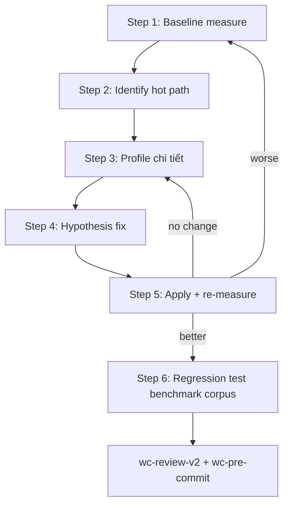

Announce: "Đang dùng wc-optimize — đo trước khi fix, không tối ưu mù."

# webclaw Optimize Guide

**Nguyên tắc:** Measure first. No blind optimization.

## Quy trình (CRITICAL)



**KHÔNG skip Step 1.** Không có baseline = không biết cải thiện bao nhiêu.

### Step 1: Baseline Measure

#### Throughput / Latency

```bash
# cargo bench với criterion
cd crates/webclaw-core
cargo bench -- --save-baseline pre_optimize

# hyperfine cho CLI latency
hyperfine --warmup 3 --runs 20 \
  'webclaw https://example.com --format llm' \
  'webclaw https://example.com --format markdown'

# benchmarks/ corpus end-to-end
cd benchmarks/
cargo run --release -- bench --save baseline.json
```

#### Memory / Alloc

```bash
# peak memory via /usr/bin/time (Linux/macOS) hoặc PowerShell (Windows)
/usr/bin/time -v cargo run --release -- https://example.com

# samply profiler (alloc profiling)
cargo install samply
samply record -- cargo run --release -- https://example.com

# dhat-rs cho heap profiling
# Add: [dev-dependencies] dhat = "0.3"
# Then run with DHAT_OUTPUT=dhat-heap.json
```

#### CPU flamegraph

```bash
cargo install flamegraph
cargo flamegraph --bin webclaw -- https://example.com
# Output: flamegraph.svg
```

### Step 2: Identify Hot Path

From profiler output, identify:

- **Top 5 functions by CPU time** — thường là parser / regex / alloc
- **Top 5 alloc sites** — usually `String::from`, `.clone()`, `Vec::push`
- **Cross-crate boundaries** — serialization cost (serde_json)

Common hot path webclaw:

| Hot path | Typical cost | Fix direction |
|----------|--------------|---------------|
| `extractor.rs` score loop | CPU bound, many regex `is_match` | Lazy static regex, short-circuit |
| `markdown.rs` tree traverse | Alloc `String::push_str` | Pre-allocate capacity, rope structure |
| `noise.rs` class filter | CPU: selector match | Batch selector, FxHashSet |
| `fetch/client.rs` request | I/O bound, network | Connection pool, HTTP/2 reuse |
| `mcp/server.rs` serialize | Alloc + CPU serde | `&'a str` over `String` ở response path |

### Step 3: Profile Detail

Khi thấy hot path → deep dive:

```bash
# cargo-profiler với callgrind (Linux)
cargo install cargo-profiler
cargo profiler callgrind --release --bin webclaw -- https://example.com

# Perf (Linux)
perf record --call-graph=dwarf cargo run --release -- https://example.com
perf report

# Instruments (macOS)
# Xcode Instruments > Time Profiler attach cargo run process
```

### Step 4: Hypothesis Fix

Common Rust optimization:

| Hypothesis | Check | Fix |
|------------|-------|-----|
| `.clone()` trên hot path | grep `\.clone()` | Prefer `&str` / `&[T]` borrow |
| `String::from` repeated | grep `String::from` | Pre-compute lazy static `&str` |
| `Vec` alloc no capacity | grep `Vec::new` | `Vec::with_capacity(n)` |
| `HashMap` default hasher | grep `HashMap::` | `FxHashMap` from `rustc-hash` |
| Regex compile loop | grep `Regex::new` in fn body | `once_cell::Lazy<Regex>` |
| async overhead sync work | `#[tokio::main]` on CPU work | `tokio::task::spawn_blocking` |
| serde_json alloc | `serde_json::to_string` hot path | `serde_json::to_writer` + pre-allocated buffer |

### Step 5: Apply + Re-measure

```bash
# re-run cùng command Step 1
cargo bench -- --save-baseline post_optimize
cargo bench -- --baseline pre_optimize    # compare

# hyperfine compare
hyperfine --warmup 3 --runs 20 \
  'target/release-pre/webclaw https://example.com' \
  'target/release-post/webclaw https://example.com'
```

Criteria:
- **Better >5%**: proceed
- **No change**: hypothesis wrong, back to Step 3
- **Worse**: revert, try different hypothesis

### Step 6: Regression Test Benchmark Corpus

```bash
cd benchmarks/
cargo run --release -- compare \
  --baseline baseline.json \
  --current current.json

# Expected: extraction quality không regression
# Speed improvement expected
# Alloc reduction bonus
```

Nếu quality regression → revert fix (speed không đáng đánh đổi correctness).

## Banned Behaviors

```
- Tối ưu mà không baseline measure
- "Có vẻ nhanh hơn" — phải có số liệu
- Micro-optimize function không trong top 5 hot path
- Đổi algorithm từ O(n log n) sang O(n) mà chưa chứng minh n đủ lớn để matter
- Clone less → add lifetime annotation everywhere (readability cost > perf gain)
- Async everything — async có overhead cho work <100µs
```

## Tool Requirement

Trước khi bắt đầu, ensure tools installed:

```bash
cargo install flamegraph      # CPU profiling
cargo install samply          # alloc profiling
cargo install hyperfine       # latency benchmarking
# criterion: đã thêm trong Cargo.toml [dev-dependencies]
```

## Output Format

```
## Optimize Report: [target]

### Baseline
- Latency p50/p95/p99: [X ms / Y ms / Z ms]
- Memory peak: [X MB]
- Alloc count: [N allocs]

### Hot Path (top 5)
1. [file:line function] — [X% CPU]
2. ...

### Hypothesis → Apply
| Hypothesis | Change | File:line |
|------------|--------|-----------|
| .clone() in hot loop | Borrow &str | extractor.rs:145 |

### Result
- Latency improvement: [X% faster]
- Memory improvement: [Y% lower]
- Corpus regression: [0%, 2 pages affected nhưng within tolerance]

### Next
→ wc-review-v2 (check correctness preserved)
→ wc-pre-commit (C10 benchmark regression)
```
