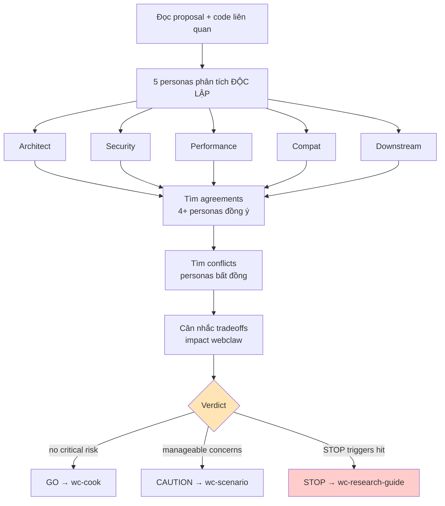

Announce: "Đang dùng wc-predict — 5 personas phân tích trước khi implement."

# webclaw Predict — 5 Personas

## Personas (CRITICAL)

| Persona | Focus webclaw-specific | Câu hỏi cốt lõi |
|---------|----------------------|-----------------|
| **Architect** | Crate boundary (WASM-safe core), dependency direction (cli → mcp → fetch/llm/pdf → core), patch isolation, trait design, feature flag | Có phù hợp kiến trúc? Scale thêm crate không break? Coupling mới nào? Vi phạm crate-boundaries.md? |
| **Security** | TLS fingerprint leak, secret in log/error/Debug impl, SSRF via user URL, qwen3 think-tag leak, input validation boundary (MCP tool param, HTTP response), unsafe blocks | Có leak secret không? SSRF attack? TLS fingerprint stable? unsafe SAFETY invariant đúng? |
| **Performance** | Alloc hot path (extractor, markdown), async runtime overhead, provider chain latency (cascading fallback), benchmark corpus regression, Clone vs Borrow, lazy static cost | Latency impact? Alloc count? Corpus regression nguy cơ? Async contention? |
| **Compat** | Multi-locale (VN/JP/ZH/RTL), encoding (UTF-8 vs gbk/shift_jis/ISO-8859-1), Content-Type edge case, primp browser profile upstream drift, rmcp version pin, MCP client spec version | Locale nào chưa test? Encoding edge? MCP client version nào break? |
| **Downstream** | MCP client consumer (Claude Desktop/Code, Cursor, Codex), CLI user workflow, library API consumer, WASM target downstream (future), breaking change impact | MCP tool schema break? CLI flag đổi semantics? Public API deprecation path? |

## Debate Protocol (CRITICAL)



**Sơ đồ là nguồn chuẩn.**

1. **Đọc** proposed change/feature description
2. **Đọc code liên quan** nếu có file path (grep affected crate)
3. **Mỗi persona phân tích ĐỘC LẬP** — không ảnh hưởng lẫn nhau
4. **Xác định agreements** — điểm 4+ personas đồng ý
5. **Xác định conflicts** — điểm bất đồng có ý nghĩa
6. **Cân nhắc tradeoffs** — concern nào impact cao hơn cho webclaw?
7. **Verdict: GO / CAUTION / STOP** với recommendations cụ thể

## Verdict Levels (IMPORTANT)

| Verdict | Nghĩa | Hành động |
|---------|-------|-----------|
| **GO** | Tất cả personas aligned, không risk critical | Tiến hành wc-cook |
| **CAUTION** | Có concerns nhưng manageable, mitigation identified | Tiến hành với mitigation, invoke wc-scenario |
| **STOP** | Critical unresolved issue — cần redesign hoặc thêm info | DỪNG, discuss user |

### STOP Triggers (bất kỳ 1 đủ)

- **Security**: secret leak / SSRF không có mitigation, unsafe block không chứng minh được invariant
- **Architect**: design vi phạm crate boundary (WASM-safe core) không workaround
- **Performance**: >10% regression trên benchmark corpus không acceptable
- **Compat**: breaking change rmcp API hoặc MCP spec mà không migration path
- **Downstream**: MCP tool schema break mà không version bump

## Output Format (IMPORTANT)

```
## Prediction Report: [tên proposal]
## Verdict: GO | CAUTION | STOP

### Agreements (4+ personas đồng ý)
- [Điểm 1]
- [Điểm 2]

### Conflicts & Resolutions
| Topic | Architect | Security | Performance | Compat | Downstream | Resolution |
|-------|-----------|----------|-------------|--------|-----------|------------|
| [issue] | [view] | [view] | [view] | [view] | [view] | [how to resolve] |

### Risk Summary
| Risk | Severity | Mitigation |
|------|----------|------------|
| [risk] | Critical/High/Med/Low | [mitigation plan] |

### Recommendations
1. [Action — lý do]
2. [Action — lý do]

### Next skill
- GO → wc-cook
- CAUTION → wc-scenario (edge cases) → wc-cook
- STOP → wc-research-guide (alternative design)
```

## Example — Add wasm target support

**Proposal**: thêm `crates/webclaw-core/` build WASM target.

| Persona | Analysis |
|---------|----------|
| Architect | GO — core đã WASM-safe invariant, chỉ cần feature flag + CI job |
| Security | GO — WASM sandbox thêm layer, không giảm security |
| Performance | CAUTION — WASM build slower startup, chỉ enable cho specific use case |
| Compat | CAUTION — chưa test multi-locale trong WASM runtime, encoding library support limited |
| Downstream | CAUTION — MCP client downstream có thể expect native binary; WASM chỉ cho embed use case |

**Verdict: CAUTION** → invoke wc-scenario để check encoding + bench regression → wc-cook.

## Kết hợp

| Sau predict | Skill tiếp | Khi nào |
|-------------|-----------|---------|
| GO | wc-cook (implement) | Confidence cao |
| CAUTION | wc-scenario (edge case) → wc-cook | Có concern quản lý được |
| STOP | wc-research-guide (redesign) | Critical issue |
