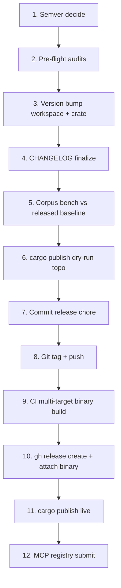

Announce: "Đang dùng wc-release — orchestrate release workflow đầy đủ."

# webclaw Release Workflow

## Release Checklist (CRITICAL — 12 bước)



### 1. Semver Decide

Analyze changes since last release (`git log --oneline v<last>...HEAD`):

| Change type | Version bump |
|-------------|--------------|
| Breaking API (MCP tool schema, CLI flag, library pub fn) | MAJOR `0.3.x → 0.4.0` or `1.0.x → 2.0.0` |
| New feature (new MCP tool, new CLI flag) non-breaking | MINOR `0.3.4 → 0.4.0` |
| Bug fix, perf, doc | PATCH `0.3.4 → 0.3.5` |

**Pre-1.0 convention:** breaking = minor bump. So `0.3.4 → 0.4.0` nếu breaking, `0.3.4 → 0.3.5` nếu non-breaking.

**Current version:** check `Cargo.toml` root `[workspace.package] version = "0.3.4"`.

### 2. Pre-flight Audits (BẮT BUỘC)

Chạy tuần tự, 0 error cho phép:

```bash
# Security
cargo audit --deny warnings
cargo deny check

# Dependencies
cargo outdated --workspace --depth 1   # review, not block

# Quality
cargo clippy --workspace --all-targets -- -D warnings
cargo fmt --check

# Tests
cargo test --workspace

# Benchmarks (nếu chạm core)
cd benchmarks/
cargo run --release -- bench --save release_candidate.json
cargo run --release -- compare --baseline baseline.json --current release_candidate.json
# Expected: 0 regression >5%
```

Nếu bất kỳ fail → invoke `wc-pre-commit` → fix → retry.

### 3. Version Bump

**Workspace root** `D:\webclaw\Cargo.toml`:

```toml
[workspace.package]
version = "0.4.0"   # bump here, inherit to all 6 crate
```

**Crate-level** (nếu có override — hiện tại không có, all inherit):

```bash
grep -rn "^version" crates/*/Cargo.toml
# Expected: "version.workspace = true" hoặc no match
```

**Lock file**:

```bash
cargo update --workspace
# hoặc
cargo generate-lockfile
```

### 4. CHANGELOG Finalize

Convert `[Unreleased]` section → version section:

```markdown
## [0.4.0] - 2026-04-22

### Added
- MCP tool `diff_markdown` for content diff

### Changed
- **BREAKING**: `scrape` tool output field `markdown` renamed to `content` for consistency

### Fixed
- Turnstile false positive on embedded widget <100KB (contd from 80307d3)

### Dependencies
- bump rmcp 1.2 → 1.3 (non-breaking API)
- bump serde 1.0.195 → 1.0.210

## [Unreleased]
```

**Rules:**
- BREAKING marker bold ở field đổi
- Dependencies section nếu có bump significant
- Link tới commit (optional): `(#commit-hash)`
- Reverse chronological order (newest top)

### 5. Corpus Bench vs Released Baseline

```bash
# Download released baseline nếu chưa có
git show v0.3.4:benchmarks/baseline.json > /tmp/v0.3.4-baseline.json

# Compare current vs last release
cd benchmarks/
cargo run --release -- compare --baseline /tmp/v0.3.4-baseline.json --current release_candidate.json
```

Expected: quality stable (-1% tolerance), speed không regression, bot bypass unchanged.

### 6. cargo publish Dry-run (topological order)

Publish order respect dep direction:

```bash
# Order: core → fetch, llm, pdf → mcp → cli
cargo publish --dry-run -p webclaw-core
cargo publish --dry-run -p webclaw-fetch
cargo publish --dry-run -p webclaw-llm
cargo publish --dry-run -p webclaw-pdf
cargo publish --dry-run -p webclaw-mcp
cargo publish --dry-run -p webclaw-cli
```

All must PASS. Nếu fail → check:
- Missing README / LICENSE trong crate dir
- `description` / `license` / `repository` required fields
- Private registry conflict

### 7. Commit Release Chore

```bash
git add Cargo.toml Cargo.lock CHANGELOG.md
git commit -m "chore(release): v0.4.0

- Version bump workspace 0.3.4 → 0.4.0
- CHANGELOG finalized with breaking changes noted
- Dependencies audit: 0 advisories
- Corpus bench: 95.1% quality (unchanged)"
```

Attribution theo `.claude/settings.json`.

### 8. Git Tag + Push

```bash
git tag -a v0.4.0 -m "Release v0.4.0

Highlights:
- [top 3 feature/fix]

See CHANGELOG.md for full details."

git push origin main
git push origin v0.4.0
```

### 9. CI Multi-target Binary Build

`.github/workflows/release.yml` auto-trigger trên tag push:

- macOS x86_64 + arm64
- Linux x86_64 + arm64
- Windows x86_64

Verify CI green trước proceed Step 10.

### 10. gh release create

```bash
gh release create v0.4.0 \
  --title "webclaw v0.4.0" \
  --notes-file RELEASE_NOTES.md \
  --draft=false \
  ./artifacts/webclaw-v0.4.0-x86_64-apple-darwin.tar.gz \
  ./artifacts/webclaw-v0.4.0-aarch64-apple-darwin.tar.gz \
  ./artifacts/webclaw-v0.4.0-x86_64-unknown-linux-gnu.tar.gz \
  ./artifacts/webclaw-v0.4.0-aarch64-unknown-linux-gnu.tar.gz \
  ./artifacts/webclaw-v0.4.0-x86_64-pc-windows-msvc.zip
```

Hoặc download artifact từ CI workflow run + attach.

### 11. cargo publish Live

Cùng order với Step 6, nhưng không `--dry-run`:

```bash
cargo publish -p webclaw-core
# chờ 30s để crates.io index
sleep 30
cargo publish -p webclaw-fetch
# tiếp tục...
```

Nếu fail giữa chừng → một số crate đã publish (cannot rollback). Document state + continue với patch release nếu cần.

### 12. MCP Registry Submit

Nếu có change tool:

- PR tới https://github.com/modelcontextprotocol/servers (nếu có entry)
- Submit tới https://mcpservers.org/ directory
- Update https://github.com/punkpeye/awesome-mcp-servers nếu listed

Tool change list trong CHANGELOG reference.

## Rollback Plan

Nếu sau release phát hiện critical bug:

1. **Patch release** (preferred): fix + v0.4.1 trong 24h
2. **Yank crate** (emergency): `cargo yank --vers 0.4.0 webclaw-core`
3. **GitHub release draft** (hide binary): `gh release edit v0.4.0 --draft`

Yank CHỈ cho security/data-corruption bug. Consumer có thể install yanked version với exact pin, nhưng default solver skip.

## Version Drift Detection

```bash
# Verify all 6 crate cùng version
grep "^version" crates/*/Cargo.toml
grep "^version" Cargo.toml
# Expected: all "0.4.0" hoặc inherit workspace
```

## Output Format

```
## Release Report: v[X.Y.Z]

### Semver decision
- Changes: [list major/minor/patch items]
- Bump: [MAJOR/MINOR/PATCH] → v[X.Y.Z]

### Pre-flight
- cargo audit: [N advisories]
- cargo deny: [PASS]
- cargo clippy: [PASS]
- cargo test: [N tests pass]
- Corpus bench: [X% quality, delta Y%]

### Steps completed
- [x] 1. Semver
- [x] 2. Audits
- [x] 3. Version bump
- ...
- [ ] 11. cargo publish live (pending)
- [ ] 12. MCP registry submit

### Artifacts
- Git tag: v[X.Y.Z]
- gh release: [URL]
- crates.io: [6 crate published]
- Binary: [5 target]

### Next
- Monitor crates.io download
- Watch issue tracker 48h
- Announce (optional: Twitter, Reddit r/rust)
```

## Integration

- `wc-pre-commit` chạy NGAY trước Step 7 (commit)
- `wc-deps-audit` = Step 2
- `wc-mcp-guard` verify tool schema bump đúng (Step 1 semver)
- `wc-extraction-bench` = Step 5
- `wc-review-v2` đã xong trước release (PR review phase)
