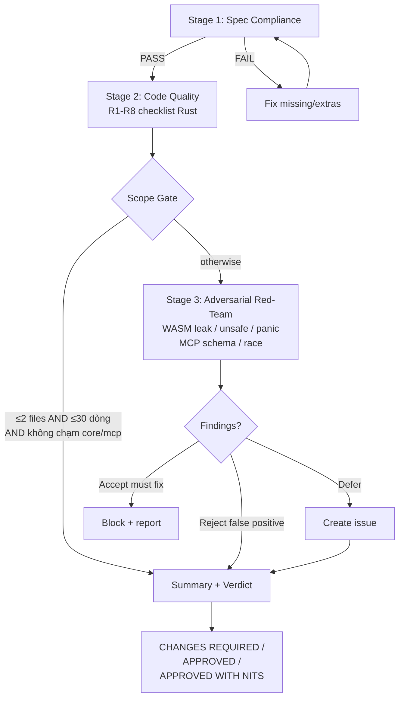

Announce: "Đang dùng wc-review-v2 — review 3 giai đoạn: spec → quality → adversarial."

## Nguyên tắc: Technical rigor > social comfort. Honest, brutal, concise.

## Phân biệt với wc-research-guide (CRITICAL)

- **wc-research-guide** = nghiên cứu/so sánh TRƯỚC khi implement (triggers: "nghiên cứu", "đánh giá", "so sánh")
- **wc-review-v2** = review code ĐÃ VIẾT sau implement (triggers: "review code mới", "adversarial", "red team")

## 3-Stage Review Protocol (CRITICAL)



**Sơ đồ là nguồn chuẩn. Nếu prose mâu thuẫn, theo sơ đồ.**

### Stage 1: Spec Compliance (PHẢI pass trước Stage 2)

- Code có match plan/yêu cầu không?
- Có thiếu requirement nào?
- Có extras không được yêu cầu? (YAGNI violation)
- Nếu có plan → so sánh plan vs diff line-by-line
- **FAIL** → list missing/extra items → fix → re-review Stage 1

### Stage 2: Code Quality — webclaw 8-Point Checklist (CRITICAL)

| # | Check | Tool/Method |
|---|-------|-------------|
| R1 | **Crate boundary** — core không import tokio/reqwest/wreq/std::fs/std::net? webclaw-llm plain reqwest (không wreq)? | `grep -rn 'use tokio\|use reqwest\|use wreq' crates/webclaw-core/src/` |
| R2 | **Unsafe audit** — có `unsafe` block mới không? Có `SAFETY:` comment giải thích invariant? | `grep -rn 'unsafe {' <files>` |
| R3 | **Error propagation** — `Result<T,E>` dùng `?`, không silent `.unwrap()` / `.expect()` trong lib code? | `grep -n '\.unwrap()\|\.expect(' crates/webclaw-*/src/` (exclude `#[cfg(test)]`) |
| R4 | **Send/Sync** — type cross-thread có đúng Send + Sync bound không? Async fn không hold non-Send across `.await`? | Manual review hoặc `cargo check` report |
| R5 | **Dependency direction** — Import đúng direction (cli → mcp → fetch/llm/pdf → core)? Không reverse? | `cargo tree -p webclaw-<crate>` |
| R6 | **MCP schema stability** — Tool schema `webclaw-mcp` có break compat không? JSON schema valid (`schemars`)? | Diff `crates/webclaw-mcp/src/server.rs` tool signatures |
| R7 | **primp patch drift** — `[patch.crates-io]` chỉ ở workspace root? Phiên bản primp/wreq/rustls/h2 patched consistent? | `grep -n patch.crates-io crates/*/Cargo.toml` |
| R8 | **Tests** — `cargo test --workspace` pass? Test mới cho code mới? Benchmark regression <5% nếu chạm extractor/markdown? | `cargo test --workspace && cargo bench -- --save-baseline pre && compare` |

### Stage 3: Adversarial Red-Team (sau Stage 2 pass) (IMPORTANT)

**Scope gate:** Skip nếu ≤2 file VÀ ≤30 dòng VÀ không chạm `crates/webclaw-core/` hoặc `crates/webclaw-mcp/`.

Tìm chủ động:

- **WASM boundary leak**: core import crate network/fs/thread. Macro expand kéo theo tokio ngầm.
- **Panic sites**: `.unwrap()`, `.expect()`, `[]` indexing không bound-check, `.parse().unwrap()`, `env::var().unwrap()` ở lib code.
- **MCP schema break**: rename field, đổi optional→required, đổi output type → break MCP client silent.
- **Secret leak**: API key/token trong log, error message, MCP response. `Debug` impl leak secret.
- **Race conditions**: concurrent cache access, stateful `Client` chia sẻ cross-thread không Send+Sync.
- **Silent failures**: `let _ = something()` swallow error, `ok_or_else(|| ...)` trả default không log, provider chain fallback ẩn lỗi thật.
- **Bot detection regression**: threshold `is_bot_protected()` thay đổi → false positive trang có widget embedded.
- **qwen3 think tag leak**: strip chỉ ở 1 tầng → leak xuống MCP consumer.
- **Cargo feature misuse**: `#[cfg(feature = "foo")]` không có matching feature trong `Cargo.toml`.
- **Version drift**: 6 crate version không bump đồng bộ khi release.

Output per finding:

| Finding | File:line | Verdict | Action |
|---------|-----------|---------|--------|
| [mô tả cụ thể] | `crates/...rs:123` | Accept (must fix) / Reject (false positive) / Defer (issue) | [action cụ thể] |

## Severity Labels (IMPORTANT)

| Label | Nghĩa | Hành động |
|-------|-------|-----------|
| **blocking** | WASM leak, MCP break, secret leak, panic lib code, crate boundary violation | DỪNG, fix ngay trước commit |
| **important** | Logic error, performance regression, missing test, Send/Sync miss | Fix trước merge |
| **nit** | Style, naming, minor cleanup, clippy warning không critical | Fix khi rảnh |
| **suggestion** | Đề xuất cải thiện (clippy pedantic), không bắt buộc | Tùy maintainer |

## Output Format (IMPORTANT)

```
## Review: [crate/feature]

### Stage 1: Spec Compliance → PASS | FAIL
[details nếu FAIL]

### Stage 2: Code Quality (8-point)
PASS: R1, R2, R3, R5, R6, R8
FAIL: R4 (crates/webclaw-fetch/src/client.rs:45 — async fn hold non-Send MutexGuard across .await)
      R7 (crates/webclaw-fetch/Cargo.toml:12 — [patch.crates-io] ở crate-level, phải chuyển workspace root)

### Stage 3: Adversarial
| Finding | File:line | Verdict | Action |
|---------|-----------|---------|--------|
| .unwrap() trên selector match | crates/webclaw-core/src/extractor.rs:234 | Accept | Dùng ok_or_else |
| threshold Turnstile 50KB không cover SPA bundle >100KB | crates/webclaw-mcp/src/cloud.rs:137 | Defer | Create issue, cần corpus data |

### Summary
Total: 4 findings (2 blocking, 1 important, 1 nit)
→ CHANGES REQUIRED
```
