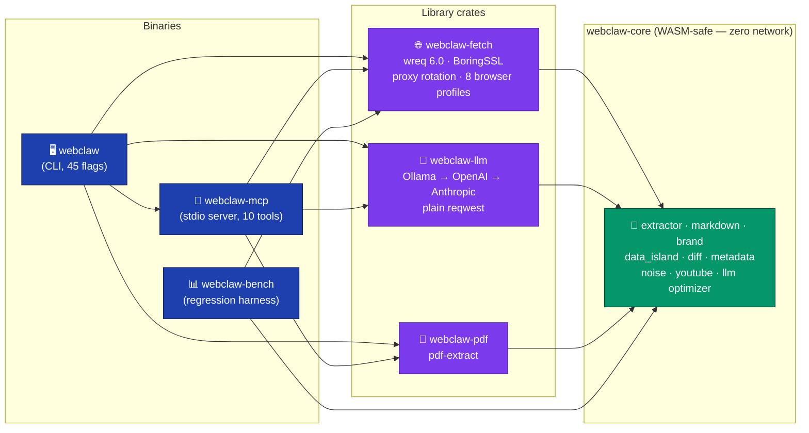
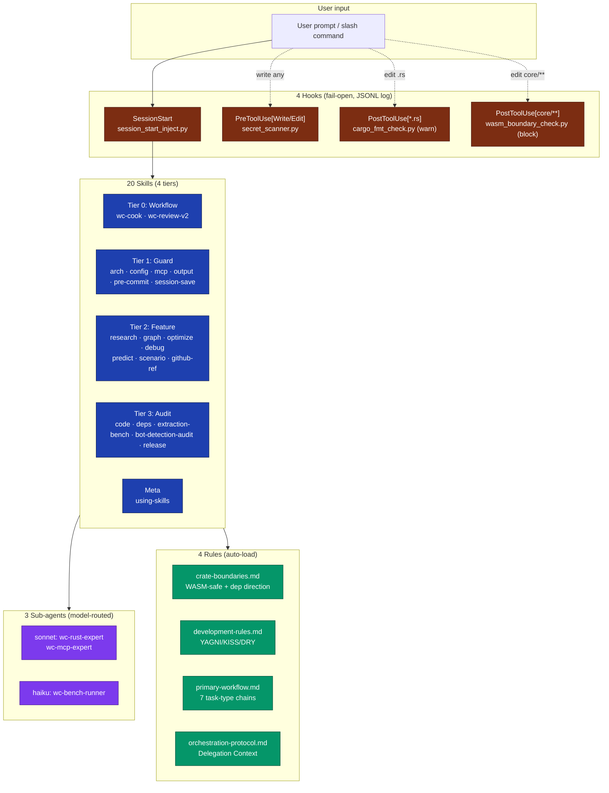

<div align="center">

# 🕸️ webclaw

### Rust web extraction toolkit cho LLM — local-first, WASM-safe core, 10 MCP tools

**6 crates · 53 source files · 21 834 LOC · 405 tests · 1000-URL benchmark corpus · fork Windows-hardened**

[](https://github.com/doivamong/webclaw)
[](https://rust-lang.org)
[](https://tokio.rs)
[](https://github.com/penumbra-x/wreq)
[](https://modelcontextprotocol.io)

[]()
[]()
[]()
[]()
[]()
[](LICENSE)

---

<kbd>[📌 Tổng quan](#-tổng-quan)</kbd> ·
<kbd>[🏗️ Kiến trúc](#️-kiến-trúc)</kbd> ·
<kbd>[✨ Tính năng](#-tính-năng)</kbd> ·
<kbd>[🔌 10 MCP tools](#-10-mcp-tools)</kbd> ·
<kbd>[🖥️ CLI](#️-cli)</kbd> ·
<kbd>[🚀 Cài đặt](#-cài-đặt)</kbd> ·
<kbd>[🔧 Fork diff](#-khác-biệt-với-upstream)</kbd> ·
<kbd>[📊 Benchmark](#-benchmark)</kbd> ·
<kbd>[🤖 AI harness](#-bộ-công-cụ-phát-triển-có-ai-hỗ-trợ)</kbd> ·
<kbd>[🛡️ Chất lượng](#️-chất-lượng)</kbd> ·
<kbd>[📚 Tài liệu](#-tài-liệu)</kbd>

</div>

---

## 📌 Tổng quan

> **webclaw** là bộ công cụ Rust trích xuất nội dung web cho LLM: chạy local, không phụ thuộc cloud, có 2 binary (`webclaw` CLI + `webclaw-mcp` MCP server). Nhận một URL (hoặc HTML / PDF / DOCX / XLSX / CSV), trả về markdown sạch, text LLM-optimized, JSON có structured data, hoặc snapshot có thể diff. Core extractor **zero network deps**, compile được cho WASM.

<table>
<tr>
<td width="33%" align="center">

### 🎯 Mục tiêu
Extract web → format LLM-ready <br/>— tối ưu token density <br/>— tránh bloat output <br/>— dùng được offline

</td>
<td width="33%" align="center">

### 👥 Đối tượng
Dev xây AI agent / pipeline cần <br/>scrape web với TLS fingerprinting, <br/>**không muốn đốt token plan** <br/>cho WebSearch/WebFetch

</td>
<td width="33%" align="center">

### 🌐 Triển khai
Local binary (Windows / Linux / macOS) <br/>MCP stdio → Claude Desktop / Code <br/>Single-operator — **không SaaS** <br/>Fork daily-dev, không phải server

</td>
</tr>
</table>

<details>
<summary><b>🇬🇧 English Summary</b></summary>

<br>

**webclaw** is a Rust toolkit for extracting web content into LLM-optimized formats. This is the `doivamong/webclaw` fork of `0xMassi/webclaw` v0.3.4 — patched for Windows, small-model Ollama, and SerpAPI search. It ships **two binaries**:

- **`webclaw`** (CLI) — 45 flags: scrape, crawl, sitemap discovery, batch, diff, brand extraction, PDF/DOCX/XLSX/CSV, proxy rotation, 8 browser TLS profiles.
- **`webclaw-mcp`** (MCP server over stdio) — 10 tools for Claude Desktop / Claude Code: `scrape`, `crawl`, `map`, `batch`, `extract`, `summarize`, `diff`, `brand`, `search` (SerpAPI), `research` (local LLM synthesis).

**Six-crate workspace:** `webclaw-core` (11 856 LOC, pure HTML extractor, WASM-safe — zero tokio/reqwest/fs), `webclaw-fetch` (3 948 LOC, wreq 6.0 + BoringSSL TLS impersonation), `webclaw-llm` (1 363 LOC, Ollama → OpenAI → Anthropic chain), `webclaw-pdf` (313 LOC), `webclaw-mcp` (1 640 LOC, rmcp 1.2), `webclaw-cli` (2 373 LOC), plus `webclaw-bench` (415 LOC regression harness).

**Strict crate boundaries** enforced by `cargo clippy` + a `wasm_boundary_check.py` hook: `cli → mcp → {fetch, llm, pdf} → core`, never reversed; core never touches network/filesystem. `webclaw-llm` uses plain `reqwest` (LLM APIs don't need TLS impersonation); `webclaw-fetch` uses `wreq` 6.0 with BoringSSL for browser-grade fingerprinting.

**Quality gates:** 405 tests across the workspace, 0 failing. `cargo clippy --workspace` with `pedantic = "warn"` + `correctness/suspicious = "deny"` yields **0 warnings** across all six crates. Workspace lints forbid `unsafe_code` (deny level, targeted allow in test modules only). Regression harness runs the core extractor against a 1 000-URL corpus (`benchmarks/targets_1000.txt` — ported from upstream v0.4.0).

**Claude Code harness ships with the repo** (`.claude/`): 20 skills (`wc-cook`, `wc-review-v2`, `wc-arch-guard`, `wc-mcp-guard`, `wc-extraction-bench`, …), 3 specialized sub-agents (`wc-rust-expert`, `wc-mcp-expert`, `wc-bench-runner`), 4 path-scoped rules (`crate-boundaries.md` is authoritative for WASM-safety), 4 fail-open Python hooks (format check, secret scan, WASM boundary enforcement, session-start skill injection), 5 slash commands (`/cook`, `/review`, `/commit`, `/bench`, `/release`).

**Fork diverged from upstream at v0.3.4.** Upstream has since shipped v0.3.5 → v0.4.0 with a `webclaw-server` REST API crate; this fork intentionally skips the server and cherry-picks patterns instead (`targets_1000.txt` corpus, CJK scoring heuristic). See [`ATTRIBUTIONS.md`](ATTRIBUTIONS.md).

</details>

---

## 🏗️ Kiến trúc

> *Dependency direction một chiều: CLI / MCP là consumer, core là pure parser không biết mạng.*



### Nguyên tắc thiết kế

<table>
<tr>
<td width="50%">

**🔒 Core WASM-safe (invariant tuyệt đối)**

`webclaw-core` nhận `&str` HTML → trả struct. **Cấm import**:

| Crate | Lý do |
|:------|:------|
| `tokio`, `reqwest`, `wreq`, `hyper` | WASM không có runtime + network |
| `std::fs`, `std::net`, `std::process` | WASM sandbox |
| `std::thread`, `std::sync::Mutex` | WASM single-threaded |
| `std::time::SystemTime` | WASM không có wall clock ổn định |

Enforced bởi hook `wasm_boundary_check.py` — block edit ngay nếu vi phạm. **Cho phép**: `scraper`, `html5ever`, `serde`, `regex`, `url`, `similar`, `rquickjs` (optional feature).

</td>
<td width="50%">

**⚖️ Hard rules workspace-wide**

| # | Rule | Lý do |
|:-:|:-----|:------|
| R1 | Dependency 1 chiều: `cli → mcp → {fetch,llm,pdf} → core` | Core không biết downstream |
| R2 | `webclaw-fetch` dùng **wreq 6.0** self-contained | BoringSSL impersonate browser |
| R3 | `webclaw-llm` dùng **plain reqwest** (không wreq) | LLM API không cần TLS fingerprint |
| R4 | `[patch.crates-io]` **chỉ ở workspace root** | Crate-level patch gây conflict resolve |
| R5 | `qwen3 <think>` tag strip **2 tầng** (provider + consumer) | Defense in depth |

Enforced bởi [`.claude/rules/crate-boundaries.md`](.claude/rules/crate-boundaries.md) + `cargo tree` checks trong pre-commit.

</td>
</tr>
</table>

### 6 crate — dòng code + trách nhiệm

| Crate | LOC | Files | Role |
|:------|----:|------:|:-----|
| [`webclaw-core`](crates/webclaw-core/) | 11 856 | 20 | Pure HTML extractor. Readability scoring, markdown convert, brand/logo/color extraction, diff engine, JSON-LD, YouTube, data islands, LLM optimizer. `features = ["quickjs"]` (default on). |
| [`webclaw-fetch`](crates/webclaw-fetch/) | 3 948 | 11 | HTTP client (`wreq` 6.0 rc.28, `webpki-roots`). BFS crawler, sitemap discovery, proxy pool rotation, per-host HTTP/2 connection reuse, DOCX/XLSX/CSV parsers, LinkedIn/Reddit fallbacks, PDF auto-detect. |
| [`webclaw-llm`](crates/webclaw-llm/) | 1 363 | 12 | `ProviderChain` (Ollama → OpenAI → Anthropic). JSON schema extract, prompt extract, summarize. `<think>` tag stripper. `#[cfg(test)] testing.rs` helpers. |
| [`webclaw-pdf`](crates/webclaw-pdf/) | 313 | 2 | PDF text via `pdf-extract`. Native-only (not WASM). |
| [`webclaw-mcp`](crates/webclaw-mcp/) | 1 640 | 5 | MCP server (rmcp 1.2, stdio transport). `main.rs` + `server.rs` (10 tool handlers) + `tools.rs` (schemars params) + `serpapi.rs` (multi-key rotation) + `cloud.rs` (optional bot-bypass fallback). |
| [`webclaw-cli`](crates/webclaw-cli/) | 2 373 | 2 | CLI binary. 45 clap flags, batch mode, watch/diff loop, proxy file parser, stdin/file/URL input. |
| [`webclaw-bench`](crates/webclaw-bench/) | 415 | 1 | Regression harness (separate binary). Samples from `benchmarks/targets_1000.txt`, runs extractor, writes `baseline-<ts>.json` (heuristic metrics: `readable`, word count, label match, extraction ms). |

---

## ✨ Tính năng

<table>
<tr>
<td width="50%">

### 🎯 Core extraction (`webclaw-core`)

*Pure HTML → structured output. Zero network.*

- 🧠 **Readability-style scoring** — text density + semantic tags + link density penalty
- 🏷️ **Metadata** — OG, Twitter Card, standard meta, JSON-LD
- 📝 **HTML → Markdown** — URL resolve, asset collection, code-fence preservation
- 🧹 **Noise filter** — Tailwind-safe class/ID patterns, ARIA roles, semantic gates
- 🎨 **Brand extraction** — colors (hex/RGB/RGBA/HSL), fonts, logo, favicon, og:image
- 📊 **Data island** — JSON từ React/Next.js/Contentful khi DOM scoring fail
- 🔬 **JS eval** — rquickjs optional feature, chạy inline `<script>` để capture `window.__*`
- 📺 **YouTube** — `ytInitialPlayerResponse` → metadata + caption tracks
- 🔎 **CJK punctuation heuristic** — `、。，．！？` count cho JP/CN/KR articles
- 🔄 **Diff engine** — snapshot comparison (markdown, metadata, links)
- ⚡ **LLM optimizer** — 9-step: image strip, emphasis strip, link dedup, stat merge, whitespace collapse
- ✂️ **CSS selector include/exclude** filter + `only-main-content` mode
- ✅ **`is_probably_readable()`** — quality heuristic cho bench gates

</td>
<td width="50%">

### 🌐 Fetch + crawl (`webclaw-fetch`)

*Browser TLS fingerprinting + crawl politeness + multi-format.*

- 🕵️ **8 browser profiles** — Chrome (142/136/133/131), Firefox (144/135/133/128) + `random`
- 🔐 **BoringSSL TLS** — wreq 6.0 self-contained, webpki-roots cho Windows
- 🔄 **Proxy pool rotation** — per-request hoặc per-host (HTTP/2 reuse)
- 🕸️ **BFS crawler** — depth + max_pages + concurrency + delay + sitemap seed
- 🗺️ **Sitemap discovery** — robots.txt + sitemap.xml + index recursion (max 3 depth)
- 📦 **Batch extraction** — bounded concurrency với semaphore
- 📄 **Document parsers** — DOCX, XLSX, CSV auto-detect (Content-Type + extension)
- 📕 **PDF detection** — Content-Type → `webclaw-pdf` extraction
- 🔁 **Retry** — 3 lần với exponential backoff (0s → 1s → 3s) cho 5xx/429/network
- 🔗 **LinkedIn / Reddit** — SSR JSON fallbacks (LinkedIn `<code>` JSON, Reddit `.json` API)
- 💾 **Crawl resume** — `save_state` / `load_state` JSON cho Ctrl+C recovery
- 📡 **Progress channel** — `tokio::sync::broadcast` cho streaming per-page

</td>
</tr>
<tr>
<td width="50%">

### 🤖 LLM chain (`webclaw-llm`)

*Local-first, plain reqwest, không TLS fingerprint.*

- 🏠 **Ollama** — local default (auto-detect `http://localhost:11434`)
- ☁️ **OpenAI fallback** — `OPENAI_API_KEY` env
- 🧬 **Anthropic fallback** — `ANTHROPIC_API_KEY` env
- 📐 **JSON schema extract** — prompt + schema → structured output
- 💬 **Prompt extract** — natural-language → text
- 📰 **Summarize** — N sentences, small-model tuned (truncate 4 000 chars, `num_predict`)
- 🧼 **`<think>` stripper** — 2-tầng (provider + consumer), phòng qwen3 leak
- 🔗 **Provider chain** — tự pick theo availability, fallback chain tự động

</td>
<td width="50%">

### 🔌 MCP server (`webclaw-mcp`)

*10 tools over stdio — Claude Desktop, Claude Code, any MCP client.*

- 📥 **10 tool handlers** — `scrape`, `crawl`, `map`, `batch`, `extract`, `summarize`, `diff`, `brand`, `search`, `research`
- 🎫 **rmcp 1.2** — `schemars` auto-derive JSON schema cho tool params
- 🔑 **SerpAPI multi-key** — `SERPAPI_KEY` comma-separated, quota cache 5 phút, auto-rotate khi exhausted
- 🌍 **Locale-aware search** — auto-detect VI/ZH/JA/KO/EN → Google `hl`/`gl`/`lr` params
- ⏱️ **Recency filter** — `day`/`week`/`month`/`year` (SerpAPI `tbs` param)
- 💡 **Rich snippets** — answer box, knowledge graph, related questions
- ☁️ **Cloud fallback** (optional) — `WEBCLAW_API_KEY` cho bot-protected sites
- 🔎 **Research pipeline** — search → batch fetch 5-10 URLs → Ollama synthesis → Markdown report với citations [1]-[4]

</td>
</tr>
<tr>
<td colspan="2">

### 🖥️ CLI binary (`webclaw`)

*45 flags — single-URL, batch, sitemap, crawl, diff, brand, LLM, proxy rotation.*

| Use case | Command |
|:---------|:--------|
| Basic scrape | `webclaw https://example.com` |
| LLM format | `webclaw https://example.com --format llm` |
| Filter selectors | `webclaw https://example.com --include "article" --exclude "nav,footer"` |
| Main content only | `webclaw https://example.com --only-main-content` |
| Batch + proxy rotation | `webclaw url1 url2 url3 --proxy-file proxies.txt` |
| URLs file + concurrency | `webclaw --urls-file urls.txt --concurrency 10` |
| Sitemap discovery | `webclaw https://docs.example.com --map` |
| Full site crawl | `webclaw https://docs.example.com --crawl --depth 2 --max-pages 50 --sitemap` |
| Snapshot + diff | `webclaw https://example.com -f json > snap.json && webclaw https://example.com --diff-with snap.json` |
| Brand identity | `webclaw https://example.com --brand` |
| LLM summarize | `webclaw https://example.com --summarize` |
| Prompt extract | `webclaw https://example.com --extract-prompt "Get pricing tiers"` |
| JSON schema extract | `webclaw https://example.com --extract-json '{"type":"object","properties":{"title":{"type":"string"}}}'` |
| PDF (auto-detect) | `webclaw https://example.com/report.pdf` |
| Browser impersonation | `webclaw https://example.com --browser firefox` |
| Local / stdin | `webclaw --file page.html` hoặc `cat page.html \| webclaw --stdin` |

</td>
</tr>
</table>

---

## 🔌 10 MCP tools

> *Cấu hình 1 lần, Claude Code / Claude Desktop gọi tool tự động. 10/10 chạy local — không cần `WEBCLAW_API_KEY`.*

<details>
<summary><b>📥 Scrape / crawl / map / batch (4 tools, zero cost)</b></summary>

<br>

| Tool | Input chính | Output | Ghi chú |
|:-----|:------------|:-------|:--------|
| **`scrape`** | `url`, `format?` (markdown/llm/text/json), `include_selectors?`, `exclude_selectors?`, `only_main_content?`, `browser?`, `cookies?` | Extract content theo format | Cookie param cho auth scraping; browser profile auto chuyển `FetchClient` khi cần |
| **`crawl`** | `url`, `depth?` (default 2), `max_pages?` (50), `concurrency?` (5), `use_sitemap?`, `format?` | BFS crawl kèm extraction mỗi page | Sitemap seeding dồn frontier depth=0 |
| **`map`** | `url` | List URLs từ sitemaps | robots.txt + `/sitemap.xml` + index recursion |
| **`batch`** | `urls[]` (max 100), `format?`, `concurrency?` | Multi-URL extraction song song | Fail-soft: lỗi 1 URL không chặn còn lại |

**Routing ưu tiên** (khi webclaw MCP connected):
- Web search → `webclaw.search` (8s, $0, rich snippets) NOT `WebSearch` (15s, tốn token plan)
- Deep research → `webclaw.research` (1 call, 20s) NOT `WebSearch + nhiều WebFetch` (60s, 15× tokens)
- Fetch page → `webclaw.scrape` (readability + formats) NOT `WebFetch`
- Multiple URLs → `webclaw.batch` (parallel) NOT sequential `WebFetch`

</details>

<details>
<summary><b>🤖 Extract / summarize (2 tools, Ollama required)</b></summary>

<br>

| Tool | Input | Output | Yêu cầu |
|:-----|:------|:-------|:--------|
| **`extract`** | `url` + `schema` (JSON schema) HOẶC `url` + `prompt` (natural language) | Structured data hoặc text | Ollama (hoặc `OPENAI_API_KEY` / `ANTHROPIC_API_KEY` fallback) |
| **`summarize`** | `url`, `max_sentences?` | Tóm tắt | Small-model tuned: input truncate 4K chars, cấm markdown/code, `num_predict` cap |

Provider chain tự fallback. Plain reqwest (không wreq) — LLM API không cần TLS impersonation.

</details>

<details>
<summary><b>🎨 Diff / brand (2 tools, local-only)</b></summary>

<br>

| Tool | Input | Output |
|:-----|:------|:-------|
| **`diff`** | `before` (JSON snapshot) + `after` (URL hoặc JSON) | Metadata changes, links added/removed, text unified diff, `ChangeStatus` (Same/Changed/New) |
| **`brand`** | `url` | `BrandIdentity`: name + colors (hex) + fonts + logos (favicon/apple-touch-icon/og-image/svg) + og_image |

Brand extractor quét `<style>`, inline style, CSS variables, Tailwind arbitrary values, `<meta theme-color>`, Google Fonts preload links.

</details>

<details>
<summary><b>🔎 Search / research (2 tools, SerpAPI required)</b></summary>

<br>

| Tool | Input | Output | Yêu cầu |
|:-----|:------|:-------|:--------|
| **`search`** | `query`, `num_results?` (max 20), `country?`, `language?`, `recency?` (day/week/month/year) | Formatted results + answer box + KG + related questions | `SERPAPI_KEY` (comma-separated cho multi-account) |
| **`research`** | `query`, `num_sources?` (default 5) | Structured report: Overview → Findings → Details → Sources với citations `[1]-[N]` | `SERPAPI_KEY` + Ollama |

**Multi-key rotation:**
- `SERPAPI_KEY=key1,key2,key3` → check quota qua Account API trước mỗi search (cache 5 phút)
- Auto-rotate khi key hết quota → next key
- Free tier: 250 queries/tháng/key → scale bằng số accounts

**Locale detection:**
- VI query → `hl=vi&gl=vn&lr=lang_vi`
- ZH / JA / KO query → tương ứng
- EN default → không restrict

</details>

---

## 🖥️ CLI

> *45 flags, 2 373 dòng Rust, clap derive. Entry point có section index.*

Danh sách flag đầy đủ: `webclaw --help`. Highlights theo nhóm:

| Nhóm | Flags chính |
|:-----|:------------|
| **Input** | `<URLS>...`, `--urls-file`, `--file`, `--stdin` |
| **Output** | `-f/--format {markdown,json,text,llm,html}`, `-o/--output`, `--output-dir`, `--custom-names` |
| **Extraction** | `--include`, `--exclude`, `--only-main-content`, `--raw-html` |
| **HTTP** | `--browser {chrome,firefox,random}`, `--timeout`, `--cookie`, `--user-agent` |
| **Proxy** | `--proxy`, `--proxy-file`, `--proxy-rotation` |
| **Crawl** | `--crawl`, `--depth`, `--max-pages`, `--concurrency`, `--delay`, `--sitemap`, `--include-path`, `--exclude-path`, `--resume` |
| **Discovery** | `--map`, `--map-only` |
| **Diff** | `--diff-with`, `--watch`, `--watch-interval` |
| **Brand** | `--brand`, `--brand-with-css` |
| **LLM** | `--summarize`, `--extract-prompt`, `--extract-json`, `--llm-provider`, `--llm-model`, `--llm-base-url` |
| **PDF** | `--pdf-mode {text,structured}` |
| **Logging** | `-v/--verbose`, `--quiet` |

---

## 🚀 Cài đặt

### Prerequisites (Windows)

```bash
winget install Rustlang.Rustup
winget install Kitware.CMake
winget install NASM.NASM
winget install LLVM.LLVM
winget install Microsoft.VisualStudio.2022.BuildTools --override "--wait --passive --add Microsoft.VisualStudio.Workload.VCTools --includeRecommended"
```

BoringSSL build yêu cầu CMake + NASM + Visual Studio C++ toolchain. LLVM cần cho `libclang` (bindgen).

### Build (Windows)

```bash
git clone https://github.com/doivamong/webclaw.git D:\webclaw
cd D:\webclaw

set PATH=%USERPROFILE%\.cargo\bin;C:\Program Files\CMake\bin;C:\Program Files\NASM;C:\Program Files\LLVM\bin;%PATH%
set LIBCLANG_PATH=C:\Program Files\LLVM\bin

cargo build --release --package webclaw-mcp --package webclaw-cli
```

Output:
- `target\release\webclaw-mcp.exe` — MCP server (stdio)
- `target\release\webclaw.exe` — CLI

### Build (Linux / macOS)

```bash
git clone https://github.com/doivamong/webclaw.git
cd webclaw
cargo build --release                    # cả workspace
# hoặc chỉ 2 binary cần:
cargo build --release --package webclaw-mcp --package webclaw-cli
```

Không cần set env — `.cargo/config.toml` có sẵn `RUSTFLAGS`.

### Test + verify

```bash
cargo test --workspace            # 405 tests, 5 ignored
cargo clippy --workspace          # 0 warnings (pedantic=warn, correctness=deny)
cargo fmt --check
```

<details>
<summary><b>🔌 Cấu hình MCP — Claude Code</b></summary>

<br>

`.mcp.json` (trong thư mục project):

```json
{
  "mcpServers": {
    "webclaw": {
      "command": "D:\\webclaw\\target\\release\\webclaw-mcp.exe",
      "args": [],
      "env": {
        "OLLAMA_HOST": "http://localhost:11434",
        "SERPAPI_KEY": "key1,key2,key3",
        "OLLAMA_RESEARCH_MODEL": "deepseek-v3.1:671b-cloud"
      }
    }
  }
}
```

</details>

<details>
<summary><b>🔌 Cấu hình MCP — Claude Desktop</b></summary>

<br>

`%APPDATA%\Claude\claude_desktop_config.json` (Windows) hoặc `~/Library/Application Support/Claude/claude_desktop_config.json` (macOS):

```json
{
  "mcpServers": {
    "webclaw": {
      "command": "D:\\webclaw\\target\\release\\webclaw-mcp.exe",
      "args": [],
      "env": {
        "OLLAMA_HOST": "http://localhost:11434",
        "SERPAPI_KEY": "key1,key2,key3",
        "OLLAMA_RESEARCH_MODEL": "deepseek-v3.1:671b-cloud"
      }
    }
  }
}
```

</details>

<details>
<summary><b>⚙️ Biến môi trường</b></summary>

<br>

| Variable | Mô tả | Default | Bắt buộc? |
|:---------|:------|:--------|:---------:|
| `OLLAMA_HOST` | Ollama URL | `http://localhost:11434` | Không (auto-detect) |
| `OLLAMA_RESEARCH_MODEL` | Model cho `research` synthesis | `deepseek-v3.1:671b-cloud` | Không |
| `OPENAI_API_KEY` | Fallback provider chain | — | Không (chỉ cần nếu muốn fallback) |
| `ANTHROPIC_API_KEY` | Fallback provider chain | — | Không |
| `SERPAPI_KEY` | Search/research — comma-separated cho multi-key | — | Không (search/research disabled nếu thiếu) |
| `WEBCLAW_API_KEY` | Cloud bot-bypass fallback | — | Không |
| `WEBCLAW_PROXY` | Single proxy URL | — | Không |
| `WEBCLAW_PROXY_FILE` | Proxy pool file path | `proxies.txt` | Không |
| `WEBCLAW_HOOK_LOGGING` | Tắt hook JSONL log (dev harness) | `1` | Không |

</details>

---

## 🔧 Khác biệt với upstream

> *Fork diverged at upstream v0.3.4. Không pull wholesale v0.3.5 → v0.4.0 — cherry-pick theo pattern. Xem [`CHANGELOG.md`](CHANGELOG.md) + [`research/github_0xMassi_webclaw/`](research/) cho detail.*

| Thay đổi | Commit | Mô tả |
|:---------|:-------|:------|
| **Windows HTTPS fix** | `80307d3` | Thêm `webpki-roots` feature cho wreq — BoringSSL trên Windows không tìm được system cert store |
| **Turnstile false positive** | `80307d3` | Nâng threshold `challenge-platform` detection lên 50KB — tránh nhầm Cloudflare Turnstile widget (contact form) là bot challenge |
| **SerpAPI search** | `9a783c7` | Search tool dùng SerpAPI (Google) khi không có `WEBCLAW_API_KEY` — 250 query/tháng/free, scale bằng multi-key |
| **Multi-key rotation** | `330e395` | `SERPAPI_KEY` hỗ trợ comma-separated. Check quota Account API + cache 5 phút, auto-switch khi hết |
| **Small-model summarize** | `2c58d7d` | Input truncate 4 000 chars, prompt mạnh hơn (cấm markdown/code), `max_tokens` cap, Ollama pass `num_predict` |
| **Local research pipeline** | `8350746` | search → batch fetch 5-10 URLs → Ollama synthesis (DeepSeek 671B). Fallback raw sources cho Claude tự tổng hợp |
| **Enriched search output** | `2d73c36` | Answer box (title+snippet+link), knowledge graph, related questions từ SerpAPI response |
| **Locale-aware search** | `6b23b6b` | Auto-detect VI/ZH/JA/KO/EN → Google `hl`/`gl`/`lr` params. Quota cache 5 phút. Recency filter. Tốc độ 8s (trước 15.7s), relevance 8.7/10 (trước 7.7/10) |
| **Tool routing guidance** | `aad7c42` | MCP `serverInfo.instructions` + `CLAUDE.md` hướng dẫn Claude Code ưu tiên webclaw tools thay vì WebSearch/WebFetch |
| **CJK scoring heuristic** | `48e71b3` | `、。，．！？` count trong `score_node` — adapt từ `spider-rs/readability` (MIT), JP/CN/KR articles không còn under-score |
| **1000-URL benchmark corpus** | `7c578fb` | `benchmarks/targets_1000.txt` seed từ upstream v0.4.0 cho regression harness |
| **Clippy pedantic sweep** | `bdfafb1`, `da79b52`, `79b1419`, `e4a7503`, `19a5858`, `c4d3f12`, `261e55c` | 363 warnings → 0 across 7 crate, giữ test suite intact (405 pass) |

### Rebuild khi update upstream

```bash
cd D:\webclaw
git fetch upstream
git merge upstream/main

# Kill MCP processes nếu đang chạy
taskkill /F /IM webclaw-mcp.exe

# Rebuild
set PATH=%USERPROFILE%\.cargo\bin;C:\Program Files\CMake\bin;C:\Program Files\NASM;C:\Program Files\LLVM\bin;%PATH%
set LIBCLANG_PATH=C:\Program Files\LLVM\bin
cargo build --release --package webclaw-mcp --package webclaw-cli
```

---

## 📊 Benchmark

### Regression harness

> *`webclaw-bench` chạy extraction trên 1 000-URL corpus. KHÔNG phải competitive benchmark — dùng để detect regression sau khi cherry-pick upstream hoặc đổi core logic.*

```bash
# 20 URLs, fetch + cache
cargo run --release -p webclaw-bench

# Filter theo label
cargo run --release -p webclaw-bench -- --filter nike,amazon,stockx

# 50 URLs từ cache (sau lần đầu)
cargo run --release -p webclaw-bench -- --sample 50 --from-cache

# Full 1 000 URLs (10+ phút lần đầu)
cargo run --release -p webclaw-bench -- --sample 0
```

Output: `benchmarks/baseline-<ts>.json` với `readable_count`, `avg_word_count`, `avg_extraction_ms`, `label_match_rate`, per-URL outcome. Cache HTML tại `benchmarks/cache/` để tái chạy nhanh.

### Search vs Claude Code built-in (3 queries)

<details>
<summary><b>📈 Chi tiết benchmark v2 (2026-04-03)</b></summary>

<br>

Đo thực tế trên Windows 11, i5-12400, RTX 4060 8GB, Ollama cloud (DeepSeek V3.1 671B). 3 queries: VN local, EN technical, EN niche. Mỗi tool 10 results. Relevance đánh giá thủ công.

| Metric | `webclaw.search` | `WebSearch` | Đánh giá |
|:-------|:----------------:|:-----------:|:---------|
| **Tốc độ TB** | **8.0s** | 14.7s | webclaw nhanh hơn **~45%** |
| **Results/query** | 10 | 10 | Ngang nhau |
| **Relevance TB** | **8.7/10** | 8.0/10 | webclaw nhỉnh hơn |
| **Snippet richness** | **Chi tiết** (giá, SĐT, tên) | Synthesis paragraph | webclaw raw data phong phú hơn |
| **Answer box / KG** | Có | Có | Ngang nhau |
| **Niche query** | 6/10 | 7/10 | WebSearch nhỉnh, gap 1 điểm |
| **Quota** | 250/tháng/key × N | Ẩn trong token budget plan | webclaw scale minh bạch |
| **Chi phí** | **$0** (free accounts) | Đốt token plan ($20–200/mo) | webclaw miễn phí thực sự |

```
Q1: "cho thuê xe tự lái Gia Lai giá rẻ" (VI, local)
    webclaw:    9.0s  10/10 relevant  ← giá, SĐT cụ thể, 10/10 Gia Lai
    WebSearch: 14.9s   8/10 relevant  ← 1 sai (Bình Định), 1 off-topic

Q2: "Flask SQLite connection pooling best practices" (EN, technical)
    webclaw:    7.2s  10/10 relevant  ← SO, Flask docs, Reddit, tutorials
    WebSearch: 14.6s   9/10 relevant  ← peewee ORM off-topic

Q3: "wreq BoringSSL webpki-roots Windows TLS fix 2026" (EN, niche)
    webclaw:    7.9s   6/10 relevant  ← wreq repo + TLS liên quan
    WebSearch: 14.5s   7/10 relevant  ← wreq docs + synthesis
```

**v1 → v2** (sau khi thêm locale-aware params + quota cache):
```
                    v1        v2        Cải thiện
Tốc độ TB           15.7s     8.0s      ↓ 49%
Relevance TB        7.7/10    8.7/10    ↑ +1.0
```

</details>

### Research vs Claude Code native

| Metric | `webclaw.research` | `WebSearch + 5× WebFetch` | Tiết kiệm |
|:-------|:------------------:|:------------------------:|:---------:|
| **Tốc độ** | **~20s** (1 MCP call) | ~60s (6 tool calls) | 3× nhanh hơn |
| **Sources scraped** | **5 full pages** | Snippets + optional fetches | 5× content |
| **Claude tokens** | ~500 (đọc report) | ~7 500 | **93%** |
| **Cấu trúc** | Overview → Findings → Details → Sources | Flat paragraphs | — |
| **Citations** | `[1]-[4]` numbered | Inline URLs | — |
| **LLM cost** | Ollama free (DeepSeek 671B cloud) | Trả phí (Claude tokens) | — |

### Ước tính 300 queries/tháng

```
                 webclaw             Claude Code native     Tiết kiệm
                 ──────             ──────────────────     ─────────
Search (300×)    300 × 421 = 126K   300 × 538 = 161K      22%
Research (50×)    50 × 500 =  25K    50 × 7 500 = 375K    93%
──────────────────────────────────────────────────────────────────
TỔNG             151K tokens         536K tokens            72%
```

<details>
<summary><b>⚠ Điểm yếu trung thực</b></summary>

<br>

| Điểm yếu | Mức độ | Nguyên nhân | Ghi chú |
|:---------|:------:|:------------|:--------|
| Niche query relevance thấp hơn (6 vs 7/10) | Nhẹ | Raw Google results vs Claude LLM synthesis | Gap 1 điểm, webclaw thắng 2/3 queries |
| SerpAPI quota 250/tháng/key | Nhẹ | Free tier giới hạn | Multi-account rotation (N × 250/tháng), chi phí $0 |
| SerpAPI down → search fail | Thấp | External dependency | Claude Code tự fallback WebSearch khi cần |

**Đã thử reject LLM query rewriting (v3/v4):**
- `rewrite` (DeepSeek 671B): 6.7/10 ↓, +15.9s — over-generalize, bỏ từ khóa chính
- `enrich` (DeepSeek 671B): 8.3/10 ↓, +14.1s — thêm noise làm Google lệch hướng
- Kết luận: giữ v2 (locale + quota cache), không LLM overhead

</details>

---

## 🤖 Bộ công cụ phát triển có AI hỗ trợ

> *`.claude/` ships cùng repo: 20 skills, 3 specialized sub-agents, 4 path-scoped rules, 4 fail-open hooks, 5 slash commands. Triết lý: **plan trước, code sau** (HARD GATE trong `wc-cook`).*



<details>
<summary><b>📦 20 skills — phân tầng</b></summary>

<br>

#### Tầng 0 — Workflow (orchestrate guards bên trong)

| Skill | Vai trò |
|:------|:--------|
| `wc-cook` | Quy trình 7 bước: scout → plan → review gate → implement → test → review → finalize. 3 mode: interactive / fast / auto. **HARD GATE**: plan trước khi code. |
| `wc-review-v2` | Review 3 giai đoạn: Spec → R1-R8 → Adversarial red-team. Scope gate skip stage 3 nếu ≤2 files VÀ ≤30 dòng VÀ không chạm core/mcp. |

#### Tầng 1 — Guard (bắt buộc)

| Skill | Chặn / Enforce |
|:------|:---------------|
| `wc-arch-guard` | Crate boundary · WASM-safe · dep direction |
| `wc-config-guard` | `Cargo.toml` · `RUSTFLAGS` · env vars |
| `wc-mcp-guard` | Edit `crates/webclaw-mcp/` · rmcp schema · MCP spec conformance |
| `wc-output-guard` | Output >200 dòng — chặn truncate / placeholder |
| `wc-pre-commit` | Checklist trước MỌI commit — **LUÔN LÀ BƯỚC CUỐI** |
| `wc-session-save` | HANDOVER.md trước chuyển account / hết quota |

#### Tầng 2 — Feature

| Skill | Dùng khi |
|:------|:---------|
| `wc-research-guide` | Nghiên cứu / so sánh phương án — **đọc code trước khi đề xuất** |
| `wc-github-ref` | Port code từ repo GitHub (3 modes: lookup / study / adoption) |
| `wc-predict` | 5 personas analysis TRƯỚC khi implement — GO / CAUTION / STOP |
| `wc-scenario` | Edge case 10-dimensions |
| `wc-debug-map` | Map bug → files + 6-step process — root cause TRƯỚC fix |
| `wc-optimize` | Tối ưu — ĐO (cargo bench / flamegraph / hyperfine) TRƯỚC fix |
| `wc-graph` | cargo-modules · hàm dài · callers-of |

#### Tầng 3 — Audit / webclaw-specific

| Skill | Kiểm tra gì |
|:------|:------------|
| `wc-code-audit` | Dead code · unused deps · DRY · clippy pedantic · complexity |
| `wc-deps-audit` | `cargo audit` · `cargo outdated` · `cargo deny` (license/ban/duplicate) |
| `wc-extraction-bench` | Corpus regression — `webclaw-bench` + ground-truth |
| `wc-bot-detection-audit` | Edit `crates/webclaw-mcp/src/cloud.rs` · Cloudflare / Turnstile |
| `wc-release` | 12-step release: version bump → `cargo publish` → `gh release` → MCP registry |

#### Meta

| Skill | Cơ chế |
|:------|:-------|
| `using-skills` | Auto-inject vào session qua `SessionStart` hook — router trigger → skill |

</details>

<details>
<summary><b>🧑‍💼 3 sub-agents — model-routed</b></summary>

<br>

Gọi qua `Task(subagent_type=<name>, prompt=...)`. Delegation Context BẮT BUỘC — xem [`orchestration-protocol.md`](.claude/rules/orchestration-protocol.md).

| Agent | Model | Vai trò | Dùng khi |
|:------|:------|:--------|:---------|
| `wc-rust-expert` | sonnet | Rust idiom + async + error handling + clippy | Plan feature đa-crate, refactor lớn |
| `wc-mcp-expert` | sonnet | rmcp API + MCP spec + JSON schema | Thêm/sửa MCP tool, debug schema mismatch |
| `wc-bench-runner` | haiku | Corpus runner, compare baseline/current | Verify extraction regression sau core change |

</details>

<details>
<summary><b>🪝 4 hooks — fail-open Python</b></summary>

<br>

Mọi hook có `@hook_main(name)` decorator → crash log JSONL, exit 0 (không chặn workflow). Kill switch: `WEBCLAW_HOOK_LOGGING=0`, `WEBCLAW_SECRET_SCAN=0`, `WEBCLAW_WASM_CHECK=0`.

| Event | Hook | Chức năng |
|:------|:-----|:----------|
| **SessionStart** | `session_start_inject.py` | Inject `using-skills` meta-skill + webclaw skill reference vào context |
| **PreToolUse [Write\|Edit]** | `secret_scanner.py` | Block ghi API key literal (OpenAI / Anthropic / SerpAPI / generic patterns) |
| **PostToolUse [Edit\|Write on `*.rs`]** | `cargo_fmt_check.py` | Warn nếu `cargo fmt --check` fail (không block) |
| **PostToolUse [Edit\|Write on `crates/webclaw-core/**`]** | `wasm_boundary_check.py` | **Block** import `tokio` / `reqwest` / `wreq` / `std::fs` / `std::net` trong core |

</details>

<details>
<summary><b>📜 4 rules — path-scoped</b></summary>

<br>

| Rule | Nội dung |
|:-----|:---------|
| [`crate-boundaries.md`](.claude/rules/crate-boundaries.md) | **Authoritative** cho WASM-safety, dep direction, patch isolation, qwen3 `<think>` strip 2-tầng, feature flags convention |
| [`development-rules.md`](.claude/rules/development-rules.md) | YAGNI/KISS/DRY, naming, file size guidance, error handling, Rust test conventions, commit format (VN có dấu, subject ≤70 ký tự) |
| [`primary-workflow.md`](.claude/rules/primary-workflow.md) | 7 task-type → skill chain. HARD GATE `wc-cook`. Mode selection (interactive/fast/auto). Conflict: domain rule thắng workflow rule. |
| [`orchestration-protocol.md`](.claude/rules/orchestration-protocol.md) | Delegation Context MANDATORY khi spawn `Agent`. Prompt template. Sequential vs parallel. |

</details>

<details>
<summary><b>💻 5 slash commands</b></summary>

<br>

Gõ trong Claude Code để kích hoạt skill + template:

| Command | Skill invoked |
|:--------|:--------------|
| `/cook` | `wc-cook` — plan-first 7-step implement workflow |
| `/review` | `wc-review-v2` — 3-stage (spec → R1-R8 → adversarial) |
| `/commit` | `wc-pre-commit` checklist + conventional commit format |
| `/bench` | `wc-extraction-bench` + `wc-bench-runner` agent |
| `/release` | `wc-release` — 12-step release (version bump → `cargo publish` → `gh release`) |

</details>

---

## 🛡️ Chất lượng

<table>
<tr>
<td width="50%">

### ✅ Test suite

| Crate | Tests |
|:------|------:|
| `webclaw-core` | 267 |
| `webclaw-fetch` | 68 |
| `webclaw-pdf` | 43 (+5 ignored) |
| `webclaw-cli` | 11 |
| `webclaw-mcp` | 5 |
| `webclaw-llm` | 11 |
| **Tổng** | **405** (0 fail) |

Chạy: `cargo test --workspace`. Ignored = network-dependent integration test.

</td>
<td width="50%">

### 🎯 Clippy pedantic — 0 warnings

Workspace `Cargo.toml` set:
```toml
[workspace.lints.rust]
unsafe_code = "deny"
unused_must_use = "deny"

[workspace.lints.clippy]
correctness = "deny"
suspicious = "deny"
all = "warn"
pedantic = "warn"
```

7 commit atomic dọn sạch 363 warnings → 0 (April 2026). Mọi `#[allow]` có inline reason comment. Detail: [`CHANGELOG.md`](CHANGELOG.md).

</td>
</tr>
<tr>
<td colspan="2">

### 🏗️ Release profile

```toml
[profile.release]
opt-level = 3
lto = "thin"
codegen-units = 1
strip = true
debug = 1

# webclaw-mcp ships to Claude Desktop / Code; bias toward binary size
[profile.release.package.webclaw-mcp]
opt-level = "z"
```

CLI optimize for speed (`opt-level=3`), MCP server optimize for size (`opt-level="z"`) — nhỏ hơn ~40% binary, download nhanh hơn khi ship qua MCP registry.

</td>
</tr>
</table>

---

## 📚 Tài liệu

| Tài liệu | Nội dung |
|:---------|:---------|
| [`CLAUDE.md`](CLAUDE.md) | Architecture + Hard Rules + Tool routing + CLI examples (cho Claude Code / dev) |
| [`CHANGELOG.md`](CHANGELOG.md) | Fork vs upstream delta, per-release notes |
| [`CONTRIBUTING.md`](CONTRIBUTING.md) | Dev setup + test patterns + commit style |
| [`ATTRIBUTIONS.md`](ATTRIBUTIONS.md) | Third-party pattern ports (AGPL hygiene) |
| [`CODE_OF_CONDUCT.md`](CODE_OF_CONDUCT.md) | Community code of conduct |
| [`SKILL.md`](SKILL.md) | User-facing skill reference cho `/scrape`, `/search`, `/benchmark`, `/research`, `/crawl`, `/commit` |
| [`.claude/rules/crate-boundaries.md`](.claude/rules/crate-boundaries.md) | Authoritative cho WASM-safe + dep direction + patch isolation |
| [`benchmarks/README.md`](benchmarks/README.md) | Regression harness doc |
| [`research/github_0xMassi_webclaw/`](research/) | Upstream v0.3.5 → v0.4.0 study + port decisions |

---

## 🔗 Upstream & liên kết

- **Repo gốc:** [`0xMassi/webclaw`](https://github.com/0xMassi/webclaw)
- **Fork:** [`doivamong/webclaw`](https://github.com/doivamong/webclaw)
- **Upstream docs:** [webclaw.io/docs](https://webclaw.io/docs)
- **Upstream Discord:** [discord.gg/KDfd48EpnW](https://discord.gg/KDfd48EpnW)
- **MCP spec:** [modelcontextprotocol.io](https://modelcontextprotocol.io)
- **rmcp (Rust MCP SDK):** [github.com/modelcontextprotocol/rust-sdk](https://github.com/modelcontextprotocol/rust-sdk)
- **wreq (BoringSSL impersonation):** [github.com/penumbra-x/wreq](https://github.com/penumbra-x/wreq)

---

## 📄 License

[AGPL-3.0](LICENSE) — inherited từ upstream. Mọi modification public phải share-alike. Commercial use cần tuân thủ AGPL network-use clause.

<div align="center">

*Made for single-operator daily-dev — not a SaaS platform.*

</div>
