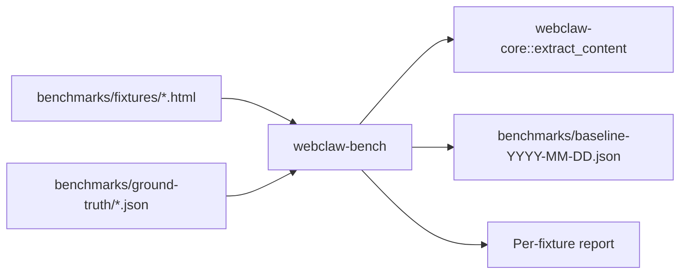

# 02 — Benchmark Harness + Corpus

> **⚠️ SUPERSEDED** bởi [`plans/2026-04-22-upstream-feature-port/04-benchmark-corpus.md`](../2026-04-22-upstream-feature-port/04-benchmark-corpus.md)
>
> Upstream có `targets_1000.txt` (1000 URL labeled) làm seed tốt hơn manual collect 18 fixture. Plan thay thế dùng upstream corpus + heuristic metrics không cần ground-truth annotation.
>
> Kept this file cho reference — DO NOT EXECUTE. Chuyển sang upstream-feature-port/04.

**Date**: 2026-04-22
**Type**: Infrastructure (new crate)
**Status**: SUPERSEDED — do not execute
**Crate(s) affected**: new `webclaw-bench` (workspace member), `benchmarks/`
**Context**: README marketing claims `cargo run -p webclaw-bench` nhưng crate chưa tồn tại. Corpus `benchmarks/fixtures/` + ground-truth cũng chưa có. Plan này tạo infrastructure để các plan khác đo regression.

## Executive Summary

Build `webclaw-bench` crate + 18 fixture (13 readability + 5 bot-protected) + ground-truth để unblock `03-readability-research.md` và validate claims trong `benchmarks/README.md`. README hiện tại là aspirational, plan này biến thành factual.

## Gap hiện tại

- `benchmarks/fixtures/` **không tồn tại**
- `benchmarks/ground-truth/` **không tồn tại**
- Crate `webclaw-bench` **không tồn tại** (README claim `cargo run -p webclaw-bench` fail)
- `D:/webclaw/benchmarks/` chỉ có 1 file: `README.md` (130 dòng marketing)

## Requirements

- [ ] Workspace member `webclaw-bench` compiles
- [ ] 18 HTML fixtures committed
- [ ] 18 ground-truth JSON committed
- [ ] Harness chạy `cargo run -p webclaw-bench` in dưới 60s
- [ ] Output baseline JSON snapshot vào `benchmarks/baseline-2026-04-22.json`
- [ ] README cập nhật (hoặc rewrite) để match reality

## Phases

### Phase 1 — Scaffold crate (1-2h)

**Files**:
- `D:/webclaw/crates/webclaw-bench/Cargo.toml` (new)
- `D:/webclaw/crates/webclaw-bench/src/main.rs` (new)
- `D:/webclaw/Cargo.toml` (add `crates/webclaw-bench` vào members — already `crates/*`)

**Cargo.toml draft**:
```toml
[package]
name = "webclaw-bench"
version.workspace = true
edition.workspace = true
license.workspace = true

[dependencies]
webclaw-core = { workspace = true }
serde = { workspace = true }
serde_json = { workspace = true }
clap = { workspace = true }
anyhow = "1"
walkdir = "2"

[lints]
workspace = true
```

**main.rs draft**:
```rust
use std::path::PathBuf;
use clap::Parser;

#[derive(Parser)]
struct Args {
    /// Fixture directory (default: benchmarks/fixtures)
    #[arg(long, default_value = "benchmarks/fixtures")]
    fixtures: PathBuf,
    /// Output baseline JSON
    #[arg(long, default_value = "benchmarks/baseline.json")]
    output: PathBuf,
}

fn main() -> anyhow::Result<()> { /* iterate fixtures, run extract, compare truth, write JSON */ }
```

**Acceptance**:
- [ ] `cargo build -p webclaw-bench` pass
- [ ] `cargo run -p webclaw-bench -- --help` show usage

### Phase 2 — Fixture collection (1 session)

**Structure**:
```
benchmarks/
├── fixtures/
│   ├── en/          # 5 English article
│   │   ├── bbc-2024.html
│   │   ├── nyt-tech.html
│   │   ├── wikipedia-rust.html
│   │   ├── medium-blog.html
│   │   └── dev-tutorial.html
│   ├── cjk/         # 3 CJK
│   │   ├── asahi-ja.html
│   │   ├── zhihu-zh.html
│   │   └── naver-ko.html
│   ├── docs/        # 2 TOC-heavy
│   │   ├── docs-rs-tokio.html
│   │   └── mdn-fetch.html
│   ├── edge/        # 3 edge
│   │   ├── login-page.html
│   │   ├── 404-github.html
│   │   └── empty-body.html
│   └── bot-protected/  # 5 bot challenge
│       ├── cloudflare-challenge.html
│       ├── cloudflare-turnstile.html
│       ├── datadome-challenge.html
│       ├── akamai-bot.html
│       └── perimeter-x.html
```

**Collection method**:
- Use `webclaw` CLI itself để scrape real pages, save raw HTML
- Bot-protected: reproduce locally using curl với no-impersonation → trigger challenge HTML
- Archive stable snapshots (Wayback Machine URLs) để fixtures không drift

**Acceptance**:
- [ ] 18 HTML file committed
- [ ] File size tổng <5MB (compressed trong git)
- [ ] Không chứa PII hoặc copyrighted content substantive

### Phase 3 — Ground-truth annotation (1 session)

**Schema** (`benchmarks/ground-truth/<category>/<name>.expected.json`):
```json
{
  "extraction": {
    "title_contains": "expected title substring",
    "text_contains": ["key phrase 1", "key phrase 2"],
    "text_not_contains": ["sidebar garbage"],
    "min_word_count": 200,
    "min_score": 30.0,
    "lang": "en"
  },
  "readability": {
    "is_probably_readable": true
  },
  "bot_detection": {
    "is_bot_protected": false,
    "provider": null
  }
}
```

Cho bot-protected fixture:
```json
{
  "readability": { "is_probably_readable": false },
  "bot_detection": {
    "is_bot_protected": true,
    "provider": "cloudflare",
    "challenge_type": "turnstile"
  }
}
```

**Acceptance**:
- [ ] 18 JSON files parse valid (CI: `for f in *.json; do jq empty "$f"; done`)
- [ ] Per category summary trong `benchmarks/ground-truth/README.md`

### Phase 4 — Harness logic (1 session)

**Scope main.rs**:
1. Walk `benchmarks/fixtures/`, pair each HTML với ground-truth JSON
2. Run `webclaw_core::extract_content(&doc, base_url, &opts)` per fixture
3. Compute metrics: title_match (bool), text_contains_matches (count/total), text_not_contains_violations (count), word_count, extracted_score
4. Aggregate per category + overall
5. Write JSON snapshot + human-readable summary to stdout

**Example output**:
```
[en/bbc-2024.html]        title=✓ text_in=4/4 noise_out=3/3 score=187 PASS
[en/nyt-tech.html]        title=✓ text_in=3/4 noise_out=2/3 score=142 PARTIAL
[cjk/asahi-ja.html]       title=✓ text_in=3/3 noise_out=3/3 score=89  PASS
[edge/login-page.html]    is_probably_readable=false ✓ PASS
...
Summary: 16/18 PASS, 2 PARTIAL. Baseline saved to benchmarks/baseline-2026-04-22.json
```

**Acceptance**:
- [ ] `cargo run -p webclaw-bench` completes <60s on all 18 fixtures
- [ ] Output JSON có per-fixture metrics + aggregate
- [ ] Exit code 0 nếu tất cả PASS (cho CI gate), non-zero nếu regression

### Phase 5 — README fix

**File**: `D:/webclaw/benchmarks/README.md`

**Option A — Honest**: Replace marketing numbers với "benchmark infrastructure ready, numbers pending". Cập nhật sau khi Phase 4 produce real baseline.

**Option B — Populate**: Chạy harness, lấy numbers thực, cập nhật bảng comparison với real data.

**Recommendation**: **Option A trước**, Option B khi benchmark stable (2-3 tuần iterate). Không ship fake numbers.

**Acceptance**:
- [ ] README không claim metric sai
- [ ] README có command chạy thật (`cargo run -p webclaw-bench`)

## Architecture



## Risk Assessment

| Risk | Impact | Mitigation |
|---|---|---|
| Fixture selection bias | Med | 2/5 English từ messy news sites (nhiều nav/ad) |
| Ground-truth annotation subjective | Med | Document criteria trong `ground-truth/README.md` |
| Binary blob bloat git | Low | Gzip fixtures hoặc store hash + fetch URL |
| Bot-challenge HTML stale | Med | Quarterly refresh cadence (xem 05-tls-tracking) |

## Acceptance (overall)

- [ ] `cargo build -p webclaw-bench` pass
- [ ] `cargo run -p webclaw-bench` produce JSON + summary
- [ ] 18 fixtures + 18 ground-truth committed
- [ ] README.md hết claim giả
- [ ] `wc-extraction-bench` skill giờ có thể run regression check

## Next plan

`03-readability-research.md` — sử dụng harness để threshold calibration (A1), gap analysis (B1), baseline trước flamegraph (C1).
