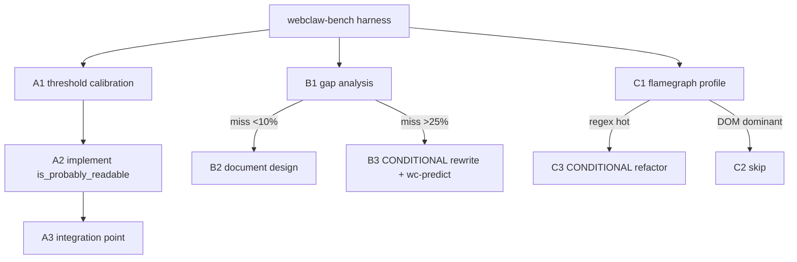

# 03 — Readability Research

**Date**: 2026-04-22
**Type**: Research + conditional implementation
**Status**: Blocked on `02-benchmark-harness.md`
**Crate(s) affected**: `webclaw-core`
**Context**: Study dom_smoothie + llm_readability → 3 research questions về extractor.rs. Mỗi question có decision gate dựa trên corpus evidence.

## Executive Summary

3 research item (A/B/C) với flowchart evidence-based decision:
- **A**: Port `is_probably_readable` fast-path cho batch workflow
- **B**: Audit score propagation (Mozilla pattern) vs webclaw "find-best + recovery"
- **C**: Flamegraph profile để confirm regex có phải bottleneck

Mỗi item research trước, implement chỉ khi evidence support.

## Dependencies

- `02-benchmark-harness.md` MUST ship first (corpus + harness needed)
- Background study: `research/github_niklak_dom_smoothie/_wc_ref_meta.md`, `research/github_spider-rs_readability/_wc_ref_meta.md`

## Item A — `is_probably_readable`

### A1 — Threshold calibration (1 session)

**Goal**: Xác định threshold phù hợp với webclaw scoring scale.

**Task**:
1. Chạy `cargo run -p webclaw-bench` trên 18 fixtures
2. Extract per-fixture score + word_count từ baseline JSON
3. Plot distribution: edge fixtures vs en/cjk/docs fixtures
4. Chọn threshold sao cho edge = false, other = true

**Expected**: `min_score ≈ 30.0`, `min_content_length = 140` (Mozilla default; webclaw scoring scale có thể cần điều chỉnh theo thực tế).

**Output**: `D:/webclaw/plans/2026-04-22-study-followup/artifacts/threshold-calibration.md` với scatter plot + recommendation.

**Acceptance**:
- [ ] All 3 edge fixtures score < threshold
- [ ] All 13 non-edge fixtures score ≥ threshold
- [ ] Document trong artifacts/

### A2 — Implement `is_probably_readable` (1 session, sau A1)

**Files**:
- `D:/webclaw/crates/webclaw-core/src/extractor.rs` — add public fn
- `D:/webclaw/crates/webclaw-core/src/lib.rs` — re-export
- `D:/webclaw/crates/webclaw-core/src/types.rs` — add `ReadabilityOpts` struct

**API draft**:
```rust
// extractor.rs
pub struct ReadabilityOpts {
    pub min_score: f64,
    pub min_content_length: usize,
}

impl Default for ReadabilityOpts {
    fn default() -> Self {
        Self { min_score: 30.0, min_content_length: 140 }
    }
}

/// Fast-path check: returns true if doc likely contains readable article content.
/// Adapted from github.com/niklak/dom_smoothie (MIT) — is_probably_readable pattern.
pub fn is_probably_readable(doc: &Html, opts: &ReadabilityOpts) -> bool {
    let Some(best) = find_best_node(doc) else { return false };
    let score = score_node(best);
    if score < opts.min_score { return false }
    let text_len = best.text().collect::<String>().len();
    text_len >= opts.min_content_length
}
```

**Constraint**: WASM-safe (pure fn, no I/O). Zero new deps.

**Acceptance**:
- [ ] Unit tests: 3 edge fixtures → false, ≥10 other → true
- [ ] `cargo test -p webclaw-core` pass
- [ ] `cargo run -p webclaw-bench` không regression (is_probably_readable không affect `extract_content` path)
- [ ] ATTRIBUTIONS.md có entry

**Commit message**: `feat(core): add is_probably_readable fast-path`

### A3 — Integration point (optional, sau A2)

**Files**:
- `D:/webclaw/crates/webclaw-fetch/src/crawler.rs` — `CrawlConfig` thêm `skip_non_readable: Option<ReadabilityOpts>`
- `D:/webclaw/crates/webclaw-mcp/src/server.rs` — `scrape` tool optional input

**Scope**: opt-in only (Default None → no behavior change). Chỉ implement khi user/maintainer có use-case rõ.

**Decision**: Defer đến khi có signal từ user. A2 standalone đủ để expose pattern cho external consumer.

## Item B — Score propagation audit

### B1 — Gap analysis (1-2 session)

**Pivot ban đầu**: Phát hiện webclaw `score_node` (`extractor.rs:762`) **KHÔNG** dùng Mozilla parent/grandparent propagation. Dùng "find-best + recovery walks" (`recover_announcements`, `recover_hero_paragraph`, `recover_section_headings`, `recover_footer_cta`, `collect_sibling_links`).

→ Không phải "gap", là "design choice".

**Task**:
1. Chạy harness baseline trên 18 fixtures
2. Với fixture nào webclaw FAIL hoặc PARTIAL, chạy same fixture qua dom_smoothie (build CLI từ `research/github_niklak_dom_smoothie/crates/cli/`)
3. So sánh: Mozilla-style propagation (dom_smoothie default) có catch case webclaw miss không?

**Classification**:
- Miss rate < 10% → STAY CURRENT, document design choice trong `extractor.rs` block comment
- 10-25% → OPT-IN FEATURE FLAG, add `ScoringMode::{FindBest, MozillaPropagation}` enum
- \> 25% → **ESCALATE**: `wc-predict` 5-persona gate trước khi rewrite structural

**Output**: `D:/webclaw/plans/2026-04-22-study-followup/artifacts/score-propagation-gap.md`

**Acceptance**:
- [ ] Comparison table (webclaw vs dom_smoothie per fixture)
- [ ] Miss classification + decision per tier
- [ ] Design choice documented trong `extractor.rs` top-of-file

### B2 — Decision (no code, doc only)

**Most likely outcome**: STAY CURRENT + document. Webclaw có recovery walks compensate cho lack of propagation, và có module (data_island, metadata, domain, brand) mà dom_smoothie không có.

**Acceptance**:
- [ ] `extractor.rs` có block comment giải thích design choice
- [ ] Link `_wc_ref_meta.md` cho future reference

### B3 — Rewrite (CONDITIONAL, only if B1 miss >25%)

**Guard**: MANDATORY `wc-predict` 5-persona trước structural rewrite `find_best_node`.

**Scope (nếu trigger)**:
- Port propagation pattern từ llm_readability (scorer.rs:270-331)
- Maintain backward compat (feature flag hoặc `ScoringMode` enum)
- `wc-extraction-bench` regression check MUST pass

**Not in scope plan này** — chỉ escalate flag, user quyết rewrite vào plan riêng.

## Item C — Regex bottleneck profile

### C1 — Flamegraph profile (1-2 session)

**Premise correction**: `noise.rs` + `extractor.rs` **ĐÃ 0 regex** (verified grep). 77 regex concentrated in:
- `llm/cleanup.rs` (14), `llm/images.rs` (12), `llm/links.rs` (5), `llm/body.rs` (5), `llm/metadata.rs`
- `markdown.rs` (10)
- `brand.rs` (24)
- `youtube.rs` (5), `js_eval.rs` (2)

**Setup**:
- Linux required (hoặc WSL2 trên Windows). `cargo install flamegraph`
- Realistic batch: 20-30 URLs trong `urls.txt`
- Command: `cargo flamegraph --release -p webclaw-cli -- --urls-file urls.txt`

**Output**: `D:/webclaw/plans/2026-04-22-study-followup/artifacts/flamegraph-baseline.svg`

**Analysis**:
- Top 10 hot function by wall time
- Nếu regex trong top 10 → target refactor C3
- Nếu DOM parse (scraper/html5ever) dominant → SKIP refactor

### C2 — Decision doc (no code)

**Likely outcome**: DOM parse dominant, regex not hot → SKIP C3.

**Output**: `D:/webclaw/plans/2026-04-22-study-followup/artifacts/regex-bottleneck-analysis.md`

### C3 — Refactor (CONDITIONAL, only if C1 shows regex hot)

**Scope**: Port `dom_smoothie/matching.rs` pattern (byte-level string ops) cho targeted hot function.

**Per-function criteria**:
- Wall time >5% total in flamegraph
- Regex trivially replaceable (không dùng capture group phức tạp)
- Unit test coverage đầy đủ (byte-match catches fewer edges)

**Acceptance**:
- [ ] Criterion bench show ≥15% per-function improvement
- [ ] Full test suite pass
- [ ] Aggregate flamegraph re-run confirms bottleneck moved

## Architecture



## Risk Assessment

| Risk | Impact | Mitigation |
|---|---|---|
| Corpus bias skew threshold | High | 2/5 English messy site fixtures |
| Flamegraph Windows-only dev | Med | WSL2 or Linux CI container |
| B3 rewrite path | High | `wc-predict` gate mandatory |

## Quick Reference

```bash
# Run baseline benchmark
cargo run --release -p webclaw-bench

# Flamegraph (Linux/WSL)
cargo flamegraph --release -p webclaw-cli -- --urls-file plans/2026-04-22-study-followup/artifacts/urls.txt

# After A2 implement
cargo test -p webclaw-core is_probably_readable
```

## Next skill

- A1/B1/C1 research song song → `wc-research-guide` nếu cần deeper analysis
- A2 implement → `wc-cook --fast` (research xong, không cần interactive)
- B3 rewrite (nếu trigger) → **MANDATORY `wc-predict`** trước
