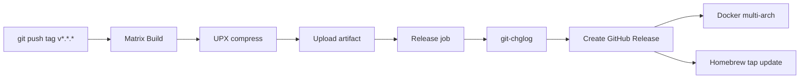

# 04 — Release Pipeline Hardening

**Date**: 2026-04-22
**Type**: CI/CD infrastructure
**Status**: Ready after `01-quick-wins.md` commit 5 (workflow_dispatch) merge
**Crate(s) affected**: `.github/workflows/release.yml`
**Context**: Study `Govcraft/rust-docs-mcp-server` release.yml — webclaw hiện thiếu Windows build, UPX compression, CHANGELOG auto-gen. Govcraft pattern MIT compat, port selectively.

## Executive Summary

3 upgrade cho release pipeline: (F2) Windows target, (F3) UPX compression, (F4) git-chglog CHANGELOG. F1 + F5 đã ship trong `01-quick-wins.md`.

Webclaw hiện tại có 3 feature Govcraft thiếu (Docker multi-arch, Homebrew tap, SHA256). Plan này KHÔNG remove, chỉ add 3 feature mới.

## Requirements

- [ ] Release pipeline tạo 5 binary artifact (4 hiện tại + Windows x86_64)
- [ ] Binary size giảm ≥40% via UPX (cho Linux + Windows)
- [ ] CHANGELOG.md auto-generate từ conventional commit
- [ ] Test run via `workflow_dispatch` trên tag giả trước merge main

## Phase F2 — Windows build target

### Scope

Add `x86_64-pc-windows-msvc` to matrix build, package as `.zip` (Windows convention).

### Files

- `D:/webclaw/.github/workflows/release.yml`

### Tasks

1. Add matrix entry:
   ```yaml
   - target: x86_64-pc-windows-msvc
     os: windows-latest
   ```

2. Install cmake cho Windows (wreq BoringSSL dep):
   ```yaml
   - name: Install cmake (Windows)
     if: runner.os == 'Windows'
     run: choco install cmake --installargs 'ADD_CMAKE_TO_PATH=System'
   ```

3. Packaging step cần Windows branch:
   ```yaml
   - name: Package (Windows)
     if: runner.os == 'Windows'
     shell: bash
     run: |
       tag="${GITHUB_REF#refs/tags/}"
       staging="webclaw-${tag}-${{ matrix.target }}"
       mkdir "$staging"
       cp target/${{ matrix.target }}/release/webclaw.exe "$staging/" 2>/dev/null || true
       cp target/${{ matrix.target }}/release/webclaw-mcp.exe "$staging/" 2>/dev/null || true
       cp README.md LICENSE "$staging/"
       7z a "$staging.zip" "$staging"
       echo "ASSET=$staging.zip" >> $GITHUB_ENV
   ```

4. Docker + Homebrew jobs giữ nguyên (Windows không tham gia).

### Acceptance

- [ ] `workflow_dispatch` trên tag giả (e.g. `v0.0.0-wintest`) produce `webclaw-v0.0.0-wintest-x86_64-pc-windows-msvc.zip`
- [ ] Download + unzip trên Windows 10/11 → `webclaw.exe --help` chạy pass
- [ ] `webclaw-mcp.exe` handshake với Claude Desktop test config

### Risk

| Risk | Mitigation |
|---|---|
| BoringSSL Windows-msvc build fail | Use pre-built wreq features if available; fallback Linux-only ship |
| Windows Defender SmartScreen warning | Document in README; defer code signing to v1.0 |
| Path separator bugs khi cross-compile | Test unzip path on Windows, use `shell: bash` cho script step |

### Effort

1-2 session (test cycle bound by runner iteration).

## Phase F3 — UPX compression

### Scope

Compress Linux + Windows binary sau build, trước upload artifact. Skip macOS (code signing break).

### Files

- `D:/webclaw/.github/workflows/release.yml` — add 2 steps giữa Build + Package

### Tasks

1. Install UPX per-OS:
   ```yaml
   - name: Install UPX (Linux)
     if: runner.os == 'Linux'
     run: sudo apt-get update && sudo apt-get install -y upx-ucl

   - name: Install UPX (Windows)
     if: runner.os == 'Windows'
     run: choco install upx --no-progress --yes
   ```

2. Compress step:
   ```yaml
   - name: Compress binaries with UPX
     if: runner.os != 'macOS'
     shell: bash
     run: |
       BIN_DIR="target/${{ matrix.target }}/release"
       for bin in webclaw webclaw-mcp webclaw.exe webclaw-mcp.exe; do
         if [[ -f "$BIN_DIR/$bin" ]]; then
           upx --best --lzma "$BIN_DIR/$bin" || echo "UPX failed on $bin (non-fatal)"
         fi
       done
   ```

### Acceptance

- [ ] Binary size giảm ≥40% post-UPX (sample Linux x86_64 baseline trước/sau)
- [ ] `webclaw --help` + `webclaw-mcp` still functional post-UPX
- [ ] `upx` failure non-fatal (fallback to uncompressed binary)

### Risk

| Risk | Mitigation |
|---|---|
| Anti-virus false positive Windows | Document in README release notes, provide unsigned download |
| UPX decompression overhead first launch | Acceptable for CLI; MCP server long-running không affect |
| UPX break on certain targets | `\|\| echo failed` pattern, ship uncompressed fallback |

### Effort

30 phút (sau F2 ship).

## Phase F4 — CHANGELOG auto-generate

### Scope

Replace GitHub auto-notes với `git-chglog` (conventional commit → structured CHANGELOG).

### Files

- `D:/webclaw/.github/workflows/release.yml` — add git-chglog step
- `D:/webclaw/.chglog/config.yml` (new)
- `D:/webclaw/.chglog/CHANGELOG.tpl.md` (new)

### Tasks

1. Create `.chglog/config.yml`:
   ```yaml
   style: github
   template: CHANGELOG.tpl.md
   options:
     commits:
       filters:
         Type:
           - feat
           - fix
           - perf
           - refactor
           - docs
     commit_groups:
       title_maps:
         feat: Features
         fix: Bug Fixes
         perf: Performance
         refactor: Refactoring
         docs: Documentation
   ```

2. Create `.chglog/CHANGELOG.tpl.md` (standard git-chglog github template).

3. Add step trong release.yml job `release`, trước `softprops/action-gh-release`:
   ```yaml
   - name: Install git-chglog
     run: |
       curl -sLo /tmp/chglog.tgz https://github.com/git-chglog/git-chglog/releases/download/v0.15.4/git-chglog_0.15.4_linux_amd64.tar.gz
       tar -xzf /tmp/chglog.tgz -C /tmp
       sudo mv /tmp/git-chglog /usr/local/bin/

   - name: Generate CHANGELOG
     run: git-chglog -o CHANGELOG.md
   ```

4. Pass CHANGELOG to release body:
   ```yaml
   - name: Create GitHub Release
     uses: softprops/action-gh-release@v2
     with:
       body_path: CHANGELOG.md  # thay generate_release_notes: true
       files: |
         artifacts/*.tar.gz
         artifacts/*.zip
         artifacts/SHA256SUMS
   ```

### Acceptance

- [ ] Release page có CHANGELOG section structured (Features / Bug Fixes / Performance / etc.)
- [ ] `git-chglog` chạy local produce same output
- [ ] Development rules đã mandate conventional commit — compat OK

### Risk

| Risk | Mitigation |
|---|---|
| Commit không theo convention | `wc-pre-commit` lint, reject non-conforming commit |
| Chglog version drift | Pin version v0.15.4 trong workflow |

### Effort

1 session (bao gồm test cycle với tag giả).

## Architecture



## Quick Reference

```bash
# Local test release.yml changes (requires act)
act -j build --matrix target:x86_64-pc-windows-msvc

# Manual workflow dispatch (sau F2 ship)
gh workflow run release.yml -f version=v0.0.0-test

# Check generated CHANGELOG locally
git-chglog > /tmp/CHANGELOG.md && less /tmp/CHANGELOG.md
```

## Acceptance (overall)

- [ ] 5 binary artifact trong release (4 cũ + Windows x86_64)
- [ ] Binary size Linux/Windows giảm ≥40% via UPX
- [ ] CHANGELOG structured trong release body
- [ ] Test run via `workflow_dispatch` trên tag giả PASS trước merge

## Next skill

- F2 Windows build → `wc-cook` interactive mode (cần test workflow cycle)
- F3 UPX → `wc-cook --fast` sau F2
- F4 CHANGELOG → `wc-cook --fast` independent
- Ship production release → `wc-release` skill orchestrate full 12-step workflow
