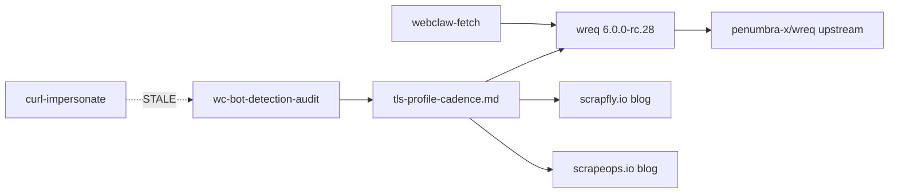

# 05 — TLS Profile Tracking

**Date**: 2026-04-22
**Type**: Audit + documentation
**Status**: Ready after `01-quick-wins.md` commit 4 (docs drift) merge
**Crate(s) affected**: `webclaw-fetch`, `.claude/skills/wc-bot-detection-audit`, `.claude/rules/`
**Context**: Study `curl-impersonate` (STALE 2024-07) + verify webclaw actual dep `wreq 6.0.0-rc.28`. Xác định upstream thật sự để track + process refresh cadence.

## Executive Summary

3 task doc/audit:
- **D2**: Audit `BrowserVariant` enum có implement thật qua wreq không (hoặc placeholder)
- **D3**: Skill `wc-bot-detection-audit` update upstream ladder (wreq primary, curl-impersonate STALE secondary)
- **D4**: Create refresh cadence rule cho TLS profile + bot detection signatures

D1 (docs drift `primp` → `wreq`) đã cover trong `01-quick-wins.md` commit 4.

## Requirements

- [ ] Browser profile matrix document tạo
- [ ] `wc-bot-detection-audit` skill có upstream ladder rõ ràng
- [ ] Refresh cadence rule document tạo
- [ ] Không code change (audit + doc only)

## Phase D2 — Browser profile audit

### Scope

Verify 5 `BrowserVariant` trong `crates/webclaw-fetch/src/browser.rs:15-22` có implement thật qua wreq không, hay placeholder enum dead code.

### Files to read (no change)

- `D:/webclaw/crates/webclaw-fetch/src/browser.rs`
- `D:/webclaw/crates/webclaw-fetch/src/client.rs` — xem `BrowserVariant::X` map đến wreq impersonation enum nào
- wreq docs: `https://docs.rs/wreq/6.0.0-rc.28/` (fetch qua `webclaw.scrape`)

### Tasks

1. Read `client.rs` xem build_client() nhận BrowserVariant và map sang wreq Impersonate::Chrome142 (hoặc tương tự)
2. Compare với `wreq::Impersonate` enum full variant list (từ docs.rs)
3. Identify:
   - Variants webclaw expose nhưng KHÔNG có wreq equivalent → flag as potential dead code
   - wreq variants có nhưng webclaw KHÔNG expose → opportunities to add

### Output

**File**: `D:/webclaw/plans/2026-04-22-study-followup/artifacts/browser-profile-matrix.md`

**Schema**:
```markdown
| webclaw BrowserVariant | wreq Impersonate equivalent | Real browser version | Status |
|---|---|---|---|
| Chrome | Impersonate::Chrome142 | Chrome 142 (2026) | IMPLEMENTED |
| ChromeMacos | ? | ? | ? |
| Firefox | Impersonate::Firefox144 | Firefox 144 | IMPLEMENTED |
| Safari | ? | ? | ? |
| Edge | ? | ? | ? |
```

### Acceptance

- [ ] Matrix document commit
- [ ] Dead code flag (nếu có) → spawn `wc-code-audit` task riêng (out of scope plan này)
- [ ] Missing coverage (nếu có) → flag trong matrix nhưng không act (scope plan khác)

### Effort

1 session (read + research docs.rs wreq).

## Phase D3 — Upstream tracking ladder

### Scope

Update `wc-bot-detection-audit` skill để clarify upstream priority.

### Files to modify

- `D:/webclaw/.claude/skills/wc-bot-detection-audit/SKILL.md` — verify file exists first

### Task

1. Read current SKILL.md, identify references đến curl-impersonate
2. Add section "Upstream ladder":
   ```markdown
   ## Upstream ladder (priority order)

   1. **Primary — TLS profile**: `penumbra-x/wreq` (`https://github.com/penumbra-x/wreq`)
      - Webclaw depend trực tiếp (wreq 6.0.0-rc.28)
      - Active: last push <1 week typical
      - Track: new release via crates.io RSS hoặc GitHub releases

   2. **Secondary — Bot detection signature**: scrapfly.io + scrapeops.io blogs
      - "Bypass Cloudflare 2026" recurring posts
      - Monitor quarterly cho new challenge type (Turnstile evolution, JA4 fingerprint)

   3. **STALE — Historical reference only**: `lwthiker/curl-impersonate`
      - Last release 2024-03 (v0.6.1), last push 2024-07
      - Max profile Chrome 116 / Firefox 109 — outdated vs webclaw Chrome 142
      - KHÔNG pull profile data từ đây
      - Blog posts của lwthiker.com vẫn useful cho TLS/HTTP fingerprinting theory
   ```

### Acceptance

- [ ] SKILL.md có section "Upstream ladder" explicit
- [ ] KHÔNG còn reference ngầm curl-impersonate như "upstream" hoặc "source of truth"

### Effort

20 phút.

## Phase D4 — Refresh cadence rule

### Scope

Tạo rule document định nghĩa quy trình review upstream.

### Files to create

- `D:/webclaw/.claude/rules/tls-profile-cadence.md` (new)

### Template

```markdown
# TLS Profile + Bot Detection Cadence

## Quarterly review (every 3 months)

- [ ] Check crates.io/crates/wreq for new version
- [ ] Read scrapfly.io blog last-quarter posts về Cloudflare/DataDome
- [ ] Read scrapeops.io blog last-quarter posts về anti-bot
- [ ] Update bot-detection corpus fixtures if challenge HTML changed
- [ ] Run `cargo run -p webclaw-bench` regression check

## Monthly spot-check

- [ ] `cargo outdated -p webclaw-fetch` — new wreq version?
- [ ] If wreq bump patch version → smoke test + bump dep
- [ ] If wreq bump minor/major → escalate to feature plan

## On browser release (Chrome/Firefox new stable)

- [ ] Check wreq release trong 2-4 tuần (upstream cadence)
- [ ] If wreq ship new profile → update webclaw `BrowserVariant::latest_*` pointer

## Anti-pattern (avoid)

- KHÔNG pull profile từ curl-impersonate (stale 2024-07)
- KHÔNG bypass wreq abstraction, dùng raw reqwest cho impersonation
- KHÔNG modify wreq source để add new profile — PR upstream penumbra-x/wreq thay vì fork
```

### Acceptance

- [ ] File exists
- [ ] Referenced từ `CLAUDE.md` section "Skills/Rules"
- [ ] Skill `wc-bot-detection-audit` link ngược tới rule này

### Effort

30 phút.

## Architecture



## Risk Assessment

| Risk | Impact | Mitigation |
|---|---|---|
| wreq upstream abandoned (theoretically) | High | Monitor quarterly; fork plan trong `wc-arch-guard` rule |
| New bot protection type emerging | Med | Scrapfly blog subscription; quarterly review |
| webclaw fall behind Chrome/Firefox stable | Low | Monthly spot-check cadence |

## Quick Reference

```bash
# Check wreq outdated
cargo outdated -p webclaw-fetch

# Read wreq docs
open https://docs.rs/wreq/6.0.0-rc.28/

# Check skill
cat D:/webclaw/.claude/skills/wc-bot-detection-audit/SKILL.md
```

## Acceptance (overall)

- [ ] D2 matrix doc trong artifacts/
- [ ] D3 skill update
- [ ] D4 rule file tạo + linked từ CLAUDE.md
- [ ] Zero code change (audit + doc only)

## Next skill

- D2 audit → `wc-research-guide` nếu cần clarify wreq API
- D3 skill update → `wc-cook --fast`
- D4 rule create → `wc-cook --fast`
