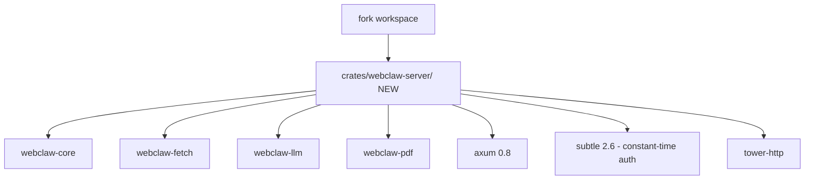

# 02 — Port `webclaw-server` REST API Crate

**Date**: 2026-04-22
**Type**: New crate (port from upstream)
**Status**: Ready, 1-2 session
**Crate(s) affected**: NEW `webclaw-server`, existing workspace root
**Context**: Upstream v0.4.0 ship `webclaw-server` — minimal axum REST API (914 LOC) cho self-host deployment. Stateless, no DB, 8 routes + /health, constant-time bearer auth. Port wholesale với attribution (same AGPL-3.0, no license gate).

## Executive Summary

Port crate `webclaw-server` từ upstream nguyên vẹn (same AGPL-3.0 license, no adaptation barriers). Fork gain REST API capability không cần viết lại. Scope: 14 file, 914 LOC, axum 0.8.

**Why port** (not "re-implement"):
- Upstream code idiomatic, already production-tested
- Same license (AGPL-3.0 both sides) — no attribution complication
- Zero architectural conflict với fork (additive crate, doesn't touch core/fetch/llm/pdf/mcp/cli)
- Saves 1-2 week implementation time

## Pre-port check

### License gate (from wc-github-ref Section 5)

- [x] Gate 1 License: PASS (upstream AGPL-3.0 = fork AGPL-3.0)
- [x] Gate 2 Boundary: PASS (new crate in workspace, WASM-safe n/a — server crate)
- [x] Gate 3 Idiom: PASS (axum + thiserror + tokio — match fork convention)

**Verdict**: adoption-approved.

## Architecture



Dependency direction tuân thủ `crate-boundaries.md`: server → {core, fetch, llm, pdf}. No reverse.

## Source (in research/)

```
research/github_0xMassi_webclaw/crates/webclaw-server/
├── Cargo.toml               (30 lines)
└── src/
    ├── auth.rs              (48 LOC) — constant-time bearer token
    ├── error.rs             (87 LOC) — ApiError + IntoResponse
    ├── main.rs              (118 LOC) — axum app setup + CLI args
    ├── state.rs             (49 LOC) — AppState shared
    └── routes/
        ├── mod.rs           (18)
        ├── health.rs        (10)
        ├── scrape.rs        (108)
        ├── crawl.rs         (85)
        ├── batch.rs         (85)
        ├── map.rs           (49)
        ├── extract.rs       (81)
        ├── summarize.rs     (52)
        ├── diff.rs          (92)
        └── brand.rs         (32)
```

Total: 914 LOC source + 30 LOC manifest.

## Implementation phases

### Phase 1 — Scaffold crate + copy (1 session)

**Tasks**:
1. Create dir: `D:/webclaw/crates/webclaw-server/`
2. Copy upstream files:
   ```bash
   cp -r research/github_0xMassi_webclaw/crates/webclaw-server/* \
         crates/webclaw-server/
   ```
3. Verify `workspace.members = ["crates/*"]` trong root `Cargo.toml` — no change needed (glob include mới dir)
4. Verify build:
   ```bash
   cargo build -p webclaw-server
   ```

**Expected issues**:
- Workspace dep mismatch: upstream's `Cargo.toml` có `webclaw-{core,fetch,llm,pdf} = { workspace = true }`. Fork workspace root MUST have these dep declarations. Verify `D:/webclaw/Cargo.toml` line 12-15:
  ```toml
  webclaw-core = { path = "crates/webclaw-core" }
  webclaw-fetch = { path = "crates/webclaw-fetch" }
  webclaw-llm = { path = "crates/webclaw-llm" }
  webclaw-pdf = { path = "crates/webclaw-pdf" }
  ```
  ✅ Fork đã có.
- axum 0.8 mới — pull fresh dep vào Cargo.lock.
- `subtle 2.6` — new dep for fork.
- `tower-http 0.6` — new dep.
- `anyhow 1` — new dep.

**Acceptance**:
- [ ] `cargo build -p webclaw-server` pass
- [ ] `cargo run -p webclaw-server -- --help` show CLI
- [ ] Binary trong `target/debug/webclaw-server` exists

### Phase 2 — Attribution + CLAUDE.md update

**Tasks**:
1. Add attribution in `D:/webclaw/ATTRIBUTIONS.md` (đã tạo qua study-followup 01-quick-wins commit 3):
   ```markdown
   ## webclaw-server crate (REST API)

   - **Source**: https://github.com/0xMassi/webclaw (AGPL-3.0)
   - **Original commit**: v0.4.0 (ccdb6d3)
   - **Used in**: `crates/webclaw-server/` (entire crate)
   - **Adaptations**: None (wholesale port, same AGPL-3.0 license)
   ```

2. Add header comment vào mỗi file `crates/webclaw-server/src/*.rs`:
   ```rust
   // Ported from github.com/0xMassi/webclaw (AGPL-3.0) at v0.4.0.
   // Fork maintains upstream interface; adaptations documented in
   // D:/webclaw/ATTRIBUTIONS.md.
   ```

3. Update `D:/webclaw/CLAUDE.md` Architecture section:
   - Crates list thêm: `webclaw-server/ # Minimal axum REST API (self-hosting)`
   - "Two binaries" → "Three binaries"
   - Add section "REST API Server (webclaw-server)" tương tự upstream CLAUDE.md

**Acceptance**:
- [ ] ATTRIBUTIONS.md có entry
- [ ] File headers present
- [ ] CLAUDE.md reflect 3 binary

### Phase 3 — Integration test

**Tasks**:
1. Smoke test:
   ```bash
   # Start server
   cargo run -p webclaw-server -- --port 3001 &

   # Test /health
   curl http://localhost:3001/health

   # Test /v1/scrape (no auth)
   curl -X POST http://localhost:3001/v1/scrape \
     -H "Content-Type: application/json" \
     -d '{"url": "https://example.com"}'
   ```

2. Auth test:
   ```bash
   # With API key
   WEBCLAW_API_KEY=test123 cargo run -p webclaw-server -- --port 3002 &

   # Should 401
   curl http://localhost:3002/v1/scrape -d '{"url":"https://example.com"}'

   # Should 200
   curl -H "Authorization: Bearer test123" \
     http://localhost:3002/v1/scrape \
     -H "Content-Type: application/json" \
     -d '{"url":"https://example.com"}'
   ```

3. Run upstream's tests if any (check `crates/webclaw-server/tests/` hoặc inline `#[cfg(test)]`).

**Acceptance**:
- [ ] All 8 routes respond (may not all work if underlying crate features missing — document gap)
- [ ] /health returns 200
- [ ] Auth mode works correctly
- [ ] No panic on malformed input (error gracefully)

### Phase 4 — Workspace integration

**Tasks**:
1. Verify all 3 binary build:
   ```bash
   cargo build --release --workspace
   ls target/release/webclaw{,-mcp,-server}
   ```

2. Update `release.yml` (qua study-followup `04-release-pipeline.md` F2 Windows + packaging):
   ```yaml
   cp target/${{ matrix.target }}/release/webclaw "$staging/"
   cp target/${{ matrix.target }}/release/webclaw-mcp "$staging/"
   cp target/${{ matrix.target }}/release/webclaw-server "$staging/"
   ```
   → Cross-reference: update qua commit trong study-followup 04-release-pipeline.md task F2.

3. Update `[profile.release.package.webclaw-mcp]` có nên apply cho webclaw-server không?
   - webclaw-server cũng là server binary — size matter cho download
   - Add:
     ```toml
     [profile.release.package.webclaw-server]
     opt-level = "z"
     ```

**Acceptance**:
- [ ] 3 binary build successful
- [ ] Release profile applied
- [ ] release.yml packaging covers 3 binary (verify via workflow_dispatch test tag)

## Risk Assessment

| Risk | Impact | Mitigation |
|---|---|---|
| Upstream code depend on feature fork doesn't have | High | Phase 1 compile check catch; if miss → narrow scope |
| Fork-specific webclaw-core API signature differ | Med | Compile error will show specifically; fix per-route |
| axum 0.8 breaking change fork deps | Low | axum self-contained, no conflict expected |
| License misread | Low | Both AGPL-3.0, verified |
| Fork CI pipeline không support 3 binary | Med | Update `.github/workflows/release.yml` trong study-followup 04 |

## Dependency notes

**New workspace deps** (add to `D:/webclaw/Cargo.toml` `[workspace.dependencies]` or leave per-crate):
- `axum = "0.8"` (per-crate OK, chỉ webclaw-server dùng)
- `tower-http = "0.6"` (per-crate)
- `subtle = "2.6"` (per-crate)
- `anyhow = "1"` (per-crate, fork có thể đã có)

**Decision**: Keep per-crate deps (webclaw-server có features flag đặc thù). Không pollute workspace.

## Acceptance (overall)

- [ ] `cargo build --release --workspace` produce 3 binary
- [ ] `cargo test --workspace` pass (webclaw-server tests + existing fork tests)
- [ ] `cargo clippy --workspace -- -D warnings` pass (có thể cần fix pedantic warning trong ported code)
- [ ] Smoke test 3 route (`/health`, `/v1/scrape`, auth mode)
- [ ] CLAUDE.md reflect 3 binary architecture
- [ ] ATTRIBUTIONS.md updated

## Next plan

- `03-docker-distribution.md` — update Dockerfile cover 3 binary
- Update study-followup `04-release-pipeline.md` F2 — package 3 binary
- Update study-followup `01-quick-wins.md` commit 4 — docs drift include webclaw-server mention
